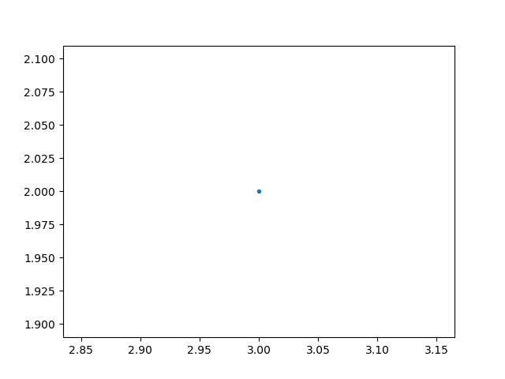

# 10-steps-to-Become-a-Data-Science
10 steps to Become a Data Science

Introduction

   
**Notebook Content**
1. [Python](#1)
    1. [Basics](#2)
    1. [Functions](#3)
    1. [Types and Sequences](#4)
    1. [More on Strings](#5)
    1. [Reading and Writing CSV files](#6)
    1. [Dates and Times](#7)
    1. [Objects and map()](#8)
    1. [Lambda and List Comprehensions](#9)
    1. [OOP](#10)
1. [Python Packages](#11)
    1. [Numpy](#12)
        1. [Creating Arrays](#13)
        1. [Combining Arrays](#14)
        1. [Operations](#15)
        1. [Math Functions](#16)
        1. [Indexing / Slicing](#17)
        1. [Copying Data](#18)
        1. [Iterating Over Arrays](#19)
        1. [The Series Data Structure](#20)
        1. [Querying a Series](#21)
    1. [Pandas](#22)
        1. [The DataFrame Data Structure](#22)
        1. [Dataframe Indexing and Loading](#23)
        1. [Missing values](#24)
        1. [Merging Dataframes](#25)
        1. [Making Code Pandorable](#26)
        1. [Group by](#27)
        1. [Scales](#28)
        1. [Pivot Tables](#29)
        1. [Date Functionality](#30)
        1. [Distributions in Pandas](#31)
        1. [Hypothesis Testing](#32)
    1. [Matplotlib](#33)
        1. [Scatterplots](#34)
        1. [Line Plots](#35)
        1. [Bar Charts](#36)
        1. [Histograms](#37)
        1. [Box and Whisker Plots](#38)
        1. [Heatmaps](#39)
        1. [Animations](#40)
        1. [Interactivity](#41)
        1. [DataFrame.plot](#42)
    1. [seaborn](#43)
    1. [SKlearn](#12)
        1. [Hypothesis Testing](#32)
1. [Mathematics and Linear Algebra](#16)
    1. [Hypothesis Testing](#32)
1. [Programming & Analysis Tools](#25)
    1. [Hypothesis Testing](#32)
1. [Big Data](#32)
1. [Data visualization](#32)
1. [Data Cleaning](#32)
1. [How to solve Problem?](#32)
1. [Machine Learning](#32)
1. [Deep Learning](#32)

1-Python

1-2 Python: Basics

1-3 Python : Functions

add_numbers is a function that takes two numbers and adds them together.

def add_numbers(x, y):
    return x + y
​
add_numbers(1, 2)
3

add_numbers updated to take an optional 3rd parameter. Using print allows printing of multiple expressions within a single cell.

def add_numbers(x,y,z=None):
    if (z==None):
        return x+y
    else:
        return x+y+z
​
print(add_numbers(1, 2))
print(add_numbers(1, 2, 3))
3
6

add_numbers updated to take an optional flag parameter.

def add_numbers(x, y, z=None, flag=False):
    if (flag):
        print('Flag is true!')
    if (z==None):
        return x + y
    else:
        return x + y + z
    
print(add_numbers(1, 2, flag=True))
Flag is true!
3

Assign function add_numbers to variable a.

def add_numbers(x,y):
    return x+y
​
a = add_numbers
a(1,2)
3

1-4 Python : Types and Sequences

Use type to return the object's type.

type('This is a string')
str

type(None)
NoneType

type(1)
int

type(1.0)
float

type(add_numbers)
function

Tuples are an immutable data structure (cannot be altered).

x = (1, 'a', 2, 'b')
type(x)
tuple

Lists are a mutable data structure.

x = [1, 'a', 2, 'b']
type(x)
list

Use append to append an object to a list.

x.append(3.3)
print(x)
[1, 'a', 2, 'b', 3.3]

This is an example of how to loop through each item in the list.

for item in x:
    print(item)
1
a
2
b
3.3

Or using the indexing operator:

i=0
while( i != len(x) ):
    print(x[i])
    i = i + 1
1
a
2
b
3.3

Use + to concatenate lists.

[1,2] + [3,4]
[1, 2, 3, 4]

Use * to repeat lists.

[1]*3
[1, 1, 1]

Use the in operator to check if something is inside a list.

1 in [1, 2, 3]
True

Now let's look at strings. Use bracket notation to slice a string.

x = 'This is a string'
print(x[0]) #first character
print(x[0:1]) #first character, but we have explicitly set the end character
print(x[0:2]) #first two characters
​
T
T
Th

This will return the last element of the string.

x[-1]
'g'

This will return the slice starting from the 4th element from the end and stopping before the 2nd element from the end.

x[-4:-2]
'ri'

This is a slice from the beginning of the string and stopping before the 3rd element.

x[:3]
'Thi'

And this is a slice starting from the 3rd element of the string and going all the way to the end.

x[3:]
's is a string'

firstname = 'MJ'
lastname = 'Bahmani'
​
print(firstname + ' ' + lastname)
print(firstname*3)
print('mj' in firstname)
​
MJ Bahmani
MJMJMJ
False

split returns a list of all the words in a string, or a list split on a specific character.

firstname = 'Mr Dr Mj Bahmani'.split(' ')[0] # [0] selects the first element of the list
lastname = 'Mr Dr Mj Bahmani'.split(' ')[-1] # [-1] selects the last element of the list
print(firstname)
print(lastname)
Mr
Bahmani

'MJ' + str(2)
'MJ2'

Dictionaries associate keys with values.

x = {'MJ Bahmani': 'Mohamadjavad.bahmani@gmail.com', 'irmatlab': 'irmatlab.ir@gmail.com'}
x['MJ Bahmani'] # Retrieve a value by using the indexing operator
​
'Mohamadjavad.bahmani@gmail.com'

x['MJ Bahmani'] = None
x['MJ Bahmani']

Iterate over all of the keys:

for name in x:
    print(x[name])
None
irmatlab.ir@gmail.com

Iterate over all of the values:

for email in x.values():
    print(email)
None
irmatlab.ir@gmail.com

Iterate over all of the items in the list:

for name, email in x.items():
    print(name)
    print(email)
MJ Bahmani
None
irmatlab
irmatlab.ir@gmail.com

You can unpack a sequence into different variables:

x = ('MJ', 'Bahmani', 'Mohamadjavad.bahmani@gmail.com')
fname, lname, email = x

fname
'MJ'

lname
'Bahmani'

1-5 Python: More on Strings

print('MJ' + str(2))
MJ2

Python has a built in method for convenient string formatting.

sales_record = {
'price': 3.24,
'num_items': 4,
'person': 'MJ'}
​
sales_statement = '{} bought {} item(s) at a price of {} each for a total of {}'
​
print(sales_statement.format(sales_record['person'],
                             sales_record['num_items'],
                             sales_record['price'],
                             sales_record['num_items']*sales_record['price']))
​
MJ bought 4 item(s) at a price of 3.24 each for a total of 12.96

1-6 Python:Reading and Writing CSV files

Let's import our datafile train.csv

import csv
​
%precision 2
​
with open('../input/train.csv') as csvfile:
    train = list(csv.DictReader(csvfile))
    
train[:1] # The first three dictionaries in our list.
[OrderedDict([('PassengerId', '1'),
              ('Survived', '0'),
              ('Pclass', '3'),
              ('Name', 'Braund, Mr. Owen Harris'),
              ('Sex', 'male'),
              ('Age', '22'),
              ('SibSp', '1'),
              ('Parch', '0'),
              ('Ticket', 'A/5 21171'),
              ('Fare', '7.25'),
              ('Cabin', ''),
              ('Embarked', 'S')])]

csv.Dictreader has read in each row of our csv file as a dictionary. len shows that our list is comprised of 234 dictionaries.

len(train)
891

keys gives us the column names of our csv.

train[0].keys()
odict_keys(['PassengerId', 'Survived', 'Pclass', 'Name', 'Sex', 'Age', 'SibSp', 'Parch', 'Ticket', 'Fare', 'Cabin', 'Embarked'])

How to do some math action on the data set

sum(float(d['Fare']) for d in train) / len(train)
32.20

Use set to return the unique values for the type of Sex in our dataset have.

Sex = set(d['Sex'] for d in train)
Sex
{'female', 'male'}

1-7 Python: Dates and Times

import datetime as dt
import time as tm

time returns the current time in seconds since the Epoch. (January 1st, 1970)

tm.time()
1539069096.63

Convert the timestamp to datetime.

dtnow = dt.datetime.fromtimestamp(tm.time())
dtnow
datetime.datetime(2018, 10, 9, 10, 41, 39, 2872)

Handy datetime attributes:

dtnow.year, dtnow.month, dtnow.day, dtnow.hour, dtnow.minute, dtnow.second # get year, month, day, etc.from a datetime
(2018, 10, 9, 10, 41, 39)

timedelta is a duration expressing the difference between two dates.

delta = dt.timedelta(days = 100) # create a timedelta of 100 days
delta
datetime.timedelta(100)

date.today returns the current local date.

today = dt.date.today()

today - delta # the date 100 days ago
datetime.date(2018, 7, 1)

today > today-delta # compare dates
True

1-8 Python: Objects and map()

An example of a class in python:

class Person:
    department = 'School of Information' #a class variable
​
    def set_name(self, new_name): #a method
        self.name = new_name
    def set_location(self, new_location):
        self.location = new_location

person = Person()
person.set_name('MJ Bahmani')
person.set_location('MI, Berlin, Germany')
print('{} live in {} and works in the department {}'.format(person.name, person.location, person.department))
MJ Bahmani live in MI, Berlin, Germany and works in the department School of Information

Here's an example of mapping the min function between two lists.

store1 = [10.00, 11.00, 12.34, 2.34]
store2 = [9.00, 11.10, 12.34, 2.01]
cheapest = map(min, store1, store2)
cheapest
<map at 0x19e668548d0>

Now let's iterate through the map object to see the values.

for item in cheapest:
    print(item)
9.0
11.0
12.34
2.01

1-9-Python : Lambda and List Comprehensions

Here's an example of lambda that takes in three parameters and adds the first two.

my_function = lambda a, b, c : a + b

my_function(1, 2, 3)
3

Let's iterate from 0 to 999 and return the even numbers.

my_list = []
for number in range(0, 1000):
    if number % 2 == 0:
        my_list.append(number)
my_list
[0,
 2,
 4,
 6,
 8,
 10,
 12,
 14,
 16,
 18,
 20,
 22,
 24,
 26,
 28,
 30,
 32,
 34,
 36,
 38,
 40,
 42,
 44,
 46,
 48,
 50,
 52,
 54,
 56,
 58,
 60,
 62,
 64,
 66,
 68,
 70,
 72,
 74,
 76,
 78,
 80,
 82,
 84,
 86,
 88,
 90,
 92,
 94,
 96,
 98,
 100,
 102,
 104,
 106,
 108,
 110,
 112,
 114,
 116,
 118,
 120,
 122,
 124,
 126,
 128,
 130,
 132,
 134,
 136,
 138,
 140,
 142,
 144,
 146,
 148,
 150,
 152,
 154,
 156,
 158,
 160,
 162,
 164,
 166,
 168,
 170,
 172,
 174,
 176,
 178,
 180,
 182,
 184,
 186,
 188,
 190,
 192,
 194,
 196,
 198,
 200,
 202,
 204,
 206,
 208,
 210,
 212,
 214,
 216,
 218,
 220,
 222,
 224,
 226,
 228,
 230,
 232,
 234,
 236,
 238,
 240,
 242,
 244,
 246,
 248,
 250,
 252,
 254,
 256,
 258,
 260,
 262,
 264,
 266,
 268,
 270,
 272,
 274,
 276,
 278,
 280,
 282,
 284,
 286,
 288,
 290,
 292,
 294,
 296,
 298,
 300,
 302,
 304,
 306,
 308,
 310,
 312,
 314,
 316,
 318,
 320,
 322,
 324,
 326,
 328,
 330,
 332,
 334,
 336,
 338,
 340,
 342,
 344,
 346,
 348,
 350,
 352,
 354,
 356,
 358,
 360,
 362,
 364,
 366,
 368,
 370,
 372,
 374,
 376,
 378,
 380,
 382,
 384,
 386,
 388,
 390,
 392,
 394,
 396,
 398,
 400,
 402,
 404,
 406,
 408,
 410,
 412,
 414,
 416,
 418,
 420,
 422,
 424,
 426,
 428,
 430,
 432,
 434,
 436,
 438,
 440,
 442,
 444,
 446,
 448,
 450,
 452,
 454,
 456,
 458,
 460,
 462,
 464,
 466,
 468,
 470,
 472,
 474,
 476,
 478,
 480,
 482,
 484,
 486,
 488,
 490,
 492,
 494,
 496,
 498,
 500,
 502,
 504,
 506,
 508,
 510,
 512,
 514,
 516,
 518,
 520,
 522,
 524,
 526,
 528,
 530,
 532,
 534,
 536,
 538,
 540,
 542,
 544,
 546,
 548,
 550,
 552,
 554,
 556,
 558,
 560,
 562,
 564,
 566,
 568,
 570,
 572,
 574,
 576,
 578,
 580,
 582,
 584,
 586,
 588,
 590,
 592,
 594,
 596,
 598,
 600,
 602,
 604,
 606,
 608,
 610,
 612,
 614,
 616,
 618,
 620,
 622,
 624,
 626,
 628,
 630,
 632,
 634,
 636,
 638,
 640,
 642,
 644,
 646,
 648,
 650,
 652,
 654,
 656,
 658,
 660,
 662,
 664,
 666,
 668,
 670,
 672,
 674,
 676,
 678,
 680,
 682,
 684,
 686,
 688,
 690,
 692,
 694,
 696,
 698,
 700,
 702,
 704,
 706,
 708,
 710,
 712,
 714,
 716,
 718,
 720,
 722,
 724,
 726,
 728,
 730,
 732,
 734,
 736,
 738,
 740,
 742,
 744,
 746,
 748,
 750,
 752,
 754,
 756,
 758,
 760,
 762,
 764,
 766,
 768,
 770,
 772,
 774,
 776,
 778,
 780,
 782,
 784,
 786,
 788,
 790,
 792,
 794,
 796,
 798,
 800,
 802,
 804,
 806,
 808,
 810,
 812,
 814,
 816,
 818,
 820,
 822,
 824,
 826,
 828,
 830,
 832,
 834,
 836,
 838,
 840,
 842,
 844,
 846,
 848,
 850,
 852,
 854,
 856,
 858,
 860,
 862,
 864,
 866,
 868,
 870,
 872,
 874,
 876,
 878,
 880,
 882,
 884,
 886,
 888,
 890,
 892,
 894,
 896,
 898,
 900,
 902,
 904,
 906,
 908,
 910,
 912,
 914,
 916,
 918,
 920,
 922,
 924,
 926,
 928,
 930,
 932,
 934,
 936,
 938,
 940,
 942,
 944,
 946,
 948,
 950,
 952,
 954,
 956,
 958,
 960,
 962,
 964,
 966,
 968,
 970,
 972,
 974,
 976,
 978,
 980,
 982,
 984,
 986,
 988,
 990,
 992,
 994,
 996,
 998]

Now the same thing but with list comprehension.

my_list = [number for number in range(0,1000) if number % 2 == 0]
my_list
[0,
 2,
 4,
 6,
 8,
 10,
 12,
 14,
 16,
 18,
 20,
 22,
 24,
 26,
 28,
 30,
 32,
 34,
 36,
 38,
 40,
 42,
 44,
 46,
 48,
 50,
 52,
 54,
 56,
 58,
 60,
 62,
 64,
 66,
 68,
 70,
 72,
 74,
 76,
 78,
 80,
 82,
 84,
 86,
 88,
 90,
 92,
 94,
 96,
 98,
 100,
 102,
 104,
 106,
 108,
 110,
 112,
 114,
 116,
 118,
 120,
 122,
 124,
 126,
 128,
 130,
 132,
 134,
 136,
 138,
 140,
 142,
 144,
 146,
 148,
 150,
 152,
 154,
 156,
 158,
 160,
 162,
 164,
 166,
 168,
 170,
 172,
 174,
 176,
 178,
 180,
 182,
 184,
 186,
 188,
 190,
 192,
 194,
 196,
 198,
 200,
 202,
 204,
 206,
 208,
 210,
 212,
 214,
 216,
 218,
 220,
 222,
 224,
 226,
 228,
 230,
 232,
 234,
 236,
 238,
 240,
 242,
 244,
 246,
 248,
 250,
 252,
 254,
 256,
 258,
 260,
 262,
 264,
 266,
 268,
 270,
 272,
 274,
 276,
 278,
 280,
 282,
 284,
 286,
 288,
 290,
 292,
 294,
 296,
 298,
 300,
 302,
 304,
 306,
 308,
 310,
 312,
 314,
 316,
 318,
 320,
 322,
 324,
 326,
 328,
 330,
 332,
 334,
 336,
 338,
 340,
 342,
 344,
 346,
 348,
 350,
 352,
 354,
 356,
 358,
 360,
 362,
 364,
 366,
 368,
 370,
 372,
 374,
 376,
 378,
 380,
 382,
 384,
 386,
 388,
 390,
 392,
 394,
 396,
 398,
 400,
 402,
 404,
 406,
 408,
 410,
 412,
 414,
 416,
 418,
 420,
 422,
 424,
 426,
 428,
 430,
 432,
 434,
 436,
 438,
 440,
 442,
 444,
 446,
 448,
 450,
 452,
 454,
 456,
 458,
 460,
 462,
 464,
 466,
 468,
 470,
 472,
 474,
 476,
 478,
 480,
 482,
 484,
 486,
 488,
 490,
 492,
 494,
 496,
 498,
 500,
 502,
 504,
 506,
 508,
 510,
 512,
 514,
 516,
 518,
 520,
 522,
 524,
 526,
 528,
 530,
 532,
 534,
 536,
 538,
 540,
 542,
 544,
 546,
 548,
 550,
 552,
 554,
 556,
 558,
 560,
 562,
 564,
 566,
 568,
 570,
 572,
 574,
 576,
 578,
 580,
 582,
 584,
 586,
 588,
 590,
 592,
 594,
 596,
 598,
 600,
 602,
 604,
 606,
 608,
 610,
 612,
 614,
 616,
 618,
 620,
 622,
 624,
 626,
 628,
 630,
 632,
 634,
 636,
 638,
 640,
 642,
 644,
 646,
 648,
 650,
 652,
 654,
 656,
 658,
 660,
 662,
 664,
 666,
 668,
 670,
 672,
 674,
 676,
 678,
 680,
 682,
 684,
 686,
 688,
 690,
 692,
 694,
 696,
 698,
 700,
 702,
 704,
 706,
 708,
 710,
 712,
 714,
 716,
 718,
 720,
 722,
 724,
 726,
 728,
 730,
 732,
 734,
 736,
 738,
 740,
 742,
 744,
 746,
 748,
 750,
 752,
 754,
 756,
 758,
 760,
 762,
 764,
 766,
 768,
 770,
 772,
 774,
 776,
 778,
 780,
 782,
 784,
 786,
 788,
 790,
 792,
 794,
 796,
 798,
 800,
 802,
 804,
 806,
 808,
 810,
 812,
 814,
 816,
 818,
 820,
 822,
 824,
 826,
 828,
 830,
 832,
 834,
 836,
 838,
 840,
 842,
 844,
 846,
 848,
 850,
 852,
 854,
 856,
 858,
 860,
 862,
 864,
 866,
 868,
 870,
 872,
 874,
 876,
 878,
 880,
 882,
 884,
 886,
 888,
 890,
 892,
 894,
 896,
 898,
 900,
 902,
 904,
 906,
 908,
 910,
 912,
 914,
 916,
 918,
 920,
 922,
 924,
 926,
 928,
 930,
 932,
 934,
 936,
 938,
 940,
 942,
 944,
 946,
 948,
 950,
 952,
 954,
 956,
 958,
 960,
 962,
 964,
 966,
 968,
 970,
 972,
 974,
 976,
 978,
 980,
 982,
 984,
 986,
 988,
 990,
 992,
 994,
 996,
 998]

1-10 OOP

2-Python Packages

2-1 Numerical Python (NumPy)

import numpy as np

2-1-1 NumPy :Creating Arrays
Create a list and convert it to a numpy array

mylist = [1, 2, 3]
x = np.array(mylist)
x
array([1, 2, 3])

Or just pass in a list directly

y = np.array([4, 5, 6])
y
array([4, 5, 6])

Pass in a list of lists to create a multidimensional array.

m = np.array([[7, 8, 9], [10, 11, 12]])
m
array([[ 7,  8,  9],
       [10, 11, 12]])

Use the shape method to find the dimensions of the array. (rows, columns)

m.shape
(2, 3)

arange returns evenly spaced values within a given interval.

n = np.arange(0, 30, 2) # start at 0 count up by 2, stop before 30
n
array([ 0,  2,  4,  6,  8, 10, 12, 14, 16, 18, 20, 22, 24, 26, 28])

reshape returns an array with the same data with a new shape.

n = n.reshape(3, 5) # reshape array to be 3x5
n
array([[ 0,  2,  4,  6,  8],
       [10, 12, 14, 16, 18],
       [20, 22, 24, 26, 28]])

linspace returns evenly spaced numbers over a specified interval.

o = np.linspace(0, 4, 9) # return 9 evenly spaced values from 0 to 4
o
array([ 0. ,  0.5,  1. ,  1.5,  2. ,  2.5,  3. ,  3.5,  4. ])

resize changes the shape and size of array in-place.

o.resize(3, 3)
o
array([[ 0. ,  0.5,  1. ],
       [ 1.5,  2. ,  2.5],
       [ 3. ,  3.5,  4. ]])

ones returns a new array of given shape and type, filled with ones.

np.ones((3, 2))
array([[ 1.,  1.],
       [ 1.,  1.],
       [ 1.,  1.]])

zeros returns a new array of given shape and type, filled with zeros.

np.zeros((2, 3))
array([[ 0.,  0.,  0.],
       [ 0.,  0.,  0.]])

eye returns a 2-D array with ones on the diagonal and zeros elsewhere.

np.eye(3)
array([[ 1.,  0.,  0.],
       [ 0.,  1.,  0.],
       [ 0.,  0.,  1.]])

diag extracts a diagonal or constructs a diagonal array.

np.diag(y)
array([[4, 0, 0],
       [0, 5, 0],
       [0, 0, 6]])

Create an array using repeating list (or see np.tile)

np.array([1, 2, 3] * 3)
array([1, 2, 3, 1, 2, 3, 1, 2, 3])

Repeat elements of an array using repeat.

np.repeat([1, 2, 3], 3)
array([1, 1, 1, 2, 2, 2, 3, 3, 3])

2-1-2 Numpy:Combining Arrays

p = np.ones([2, 3], int)
p
array([[1, 1, 1],
       [1, 1, 1]])

Use vstack to stack arrays in sequence vertically (row wise).

np.vstack([p, 2*p])
array([[1, 1, 1],
       [1, 1, 1],
       [2, 2, 2],
       [2, 2, 2]])

Use hstack to stack arrays in sequence horizontally (column wise).

np.hstack([p, 2*p])
array([[1, 1, 1, 2, 2, 2],
       [1, 1, 1, 2, 2, 2]])

2-1-3 Numpy:Operations
Use +, -, *, / and ** to perform element wise addition, subtraction, multiplication, division and power.

print(x + y) # elementwise addition     [1 2 3] + [4 5 6] = [5  7  9]
print(x - y) # elementwise subtraction  [1 2 3] - [4 5 6] = [-3 -3 -3]
[5 7 9]
[-3 -3 -3]

print(x * y) # elementwise multiplication  [1 2 3] * [4 5 6] = [4  10  18]
print(x / y) # elementwise divison         [1 2 3] / [4 5 6] = [0.25  0.4  0.5]
[ 4 10 18]
[ 0.25  0.4   0.5 ]

print(x**2) # elementwise power  [1 2 3] ^2 =  [1 4 9]
[1 4 9]

Dot Product:

[x1 x2 x3]⋅y1y2y3=x1y1+x2y2+x3y3[x1 x2 x3]⋅[y1y2y3]=x1y1+x2y2+x3y3

x.dot(y) # dot product  1*4 + 2*5 + 3*6
32

z = np.array([y, y**2])
print(len(z)) # number of rows of array
2

Let's look at transposing arrays. Transposing permutes the dimensions of the array.

z = np.array([y, y**2])
z
array([[ 4,  5,  6],
       [16, 25, 36]])

The shape of array z is (2,3) before transposing.

z.shape
(2, 3)

Use .T to get the transpose.

z.T
array([[ 4, 16],
       [ 5, 25],
       [ 6, 36]])

The number of rows has swapped with the number of columns.

z.T.shape
(3, 2)

Use .dtype to see the data type of the elements in the array.

z.dtype
dtype('int32')

Use .astype to cast to a specific type.

z = z.astype('f')
z.dtype
dtype('float32')

2-1-4 Numpy: Math Functions
Numpy has many built in math functions that can be performed on arrays.

a = np.array([-4, -2, 1, 3, 5])

a.sum()
3

a.max()
5

a.min()
-4

a.mean()
0.60

a.std()
3.26

argmax and argmin return the index of the maximum and minimum values in the array.

a.argmax()
4

a.argmin()
0

2-1-5 Numpy:Indexing / Slicing

s = np.arange(13)**2
s
array([  0,   1,   4,   9,  16,  25,  36,  49,  64,  81, 100, 121, 144])

Use bracket notation to get the value at a specific index. Remember that indexing starts at 0.

s[0], s[4], s[-1]
(0, 16, 144)

Use : to indicate a range. array[start:stop]

Leaving start or stop empty will default to the beginning/end of the array.

s[1:5]
array([ 1,  4,  9, 16])

Use negatives to count from the back.

s[-4:]
array([ 81, 100, 121, 144])

A second : can be used to indicate step-size. array[start:stop:stepsize]

Here we are starting 5th element from the end, and counting backwards by 2 until the beginning of the array is reached.

s[-5::-2]
array([64, 36, 16,  4,  0])

Let's look at a multidimensional array.

r = np.arange(36)
r.resize((6, 6))
r
array([[ 0,  1,  2,  3,  4,  5],
       [ 6,  7,  8,  9, 10, 11],
       [12, 13, 14, 15, 16, 17],
       [18, 19, 20, 21, 22, 23],
       [24, 25, 26, 27, 28, 29],
       [30, 31, 32, 33, 34, 35]])

Use bracket notation to slice: array[row, column]

r[2, 2]
14

And use : to select a range of rows or columns

r[3, 3:6]
array([21, 22, 23])

Here we are selecting all the rows up to (and not including) row 2, and all the columns up to (and not including) the last column.

r[:2, :-1]
array([[ 0,  1,  2,  3,  4],
       [ 6,  7,  8,  9, 10]])

This is a slice of the last row, and only every other element.

r[-1, ::2]
array([30, 32, 34])

We can also perform conditional indexing. Here we are selecting values from the array that are greater than 30. (Also see np.where)

r[r > 30]
array([31, 32, 33, 34, 35])

Here we are assigning all values in the array that are greater than 30 to the value of 30.

r[r > 30] = 30
r
array([[ 0,  1,  2,  3,  4,  5],
       [ 6,  7,  8,  9, 10, 11],
       [12, 13, 14, 15, 16, 17],
       [18, 19, 20, 21, 22, 23],
       [24, 25, 26, 27, 28, 29],
       [30, 30, 30, 30, 30, 30]])

2-1-6 Numpy :Copying Data
Be careful with copying and modifying arrays in NumPy!

r2 is a slice of r

r2 = r[:3,:3]
r2
array([[ 0,  1,  2],
       [ 6,  7,  8],
       [12, 13, 14]])

Set this slice's values to zero ([:] selects the entire array)

r2[:] = 0
r2
array([[0, 0, 0],
       [0, 0, 0],
       [0, 0, 0]])

r has also been changed!

r
array([[ 0,  0,  0,  3,  4,  5],
       [ 0,  0,  0,  9, 10, 11],
       [ 0,  0,  0, 15, 16, 17],
       [18, 19, 20, 21, 22, 23],
       [24, 25, 26, 27, 28, 29],
       [30, 30, 30, 30, 30, 30]])

To avoid this, use r.copy to create a copy that will not affect the original array

r_copy = r.copy()
r_copy
array([[ 0,  0,  0,  3,  4,  5],
       [ 0,  0,  0,  9, 10, 11],
       [ 0,  0,  0, 15, 16, 17],
       [18, 19, 20, 21, 22, 23],
       [24, 25, 26, 27, 28, 29],
       [30, 30, 30, 30, 30, 30]])

Now when r_copy is modified, r will not be changed.

r_copy[:] = 10
print(r_copy, '\n')
print(r)
[[10 10 10 10 10 10]
 [10 10 10 10 10 10]
 [10 10 10 10 10 10]
 [10 10 10 10 10 10]
 [10 10 10 10 10 10]
 [10 10 10 10 10 10]] 

[[ 0  0  0  3  4  5]
 [ 0  0  0  9 10 11]
 [ 0  0  0 15 16 17]
 [18 19 20 21 22 23]
 [24 25 26 27 28 29]
 [30 30 30 30 30 30]]

2-1-7 Numpy: Iterating Over Arrays
Let's create a new 4 by 3 array of random numbers 0-9.

test = np.random.randint(0, 10, (4,3))
test
array([[2, 7, 6],
       [4, 9, 0],
       [1, 3, 8],
       [5, 4, 6]])

Iterate by row:

for row in test:
    print(row)
[2 7 6]
[4 9 0]
[1 3 8]
[5 4 6]

Iterate by index:

for i in range(len(test)):
    print(test[i])
[2 7 6]
[4 9 0]
[1 3 8]
[5 4 6]

Iterate by row and index:

for i, row in enumerate(test):
    print('row', i, 'is', row)
row 0 is [2 7 6]
row 1 is [4 9 0]
row 2 is [1 3 8]
row 3 is [5 4 6]

Use zip to iterate over multiple iterables.

test2 = test**2
test2
array([[ 4, 49, 36],
       [16, 81,  0],
       [ 1,  9, 64],
       [25, 16, 36]])

for i, j in zip(test, test2):
    print(i,'+',j,'=',i+j)
[2 7 6] + [ 4 49 36] = [ 6 56 42]
[4 9 0] + [16 81  0] = [20 90  0]
[1 3 8] + [ 1  9 64] = [ 2 12 72]
[5 4 6] + [25 16 36] = [30 20 42]

2-1-8 Numpy: The Series Data Structure

import pandas as pd

animals = ['Tiger', 'Bear', 'Moose']
pd.Series(animals)
0    Tiger
1     Bear
2    Moose
dtype: object

numbers = [1, 2, 3]
pd.Series(numbers)
0    1
1    2
2    3
dtype: int64

animals = ['Tiger', 'Bear', None]
pd.Series(animals)
0    Tiger
1     Bear
2     None
dtype: object

numbers = [1, 2, None]
pd.Series(numbers)
0    1.0
1    2.0
2    NaN
dtype: float64

import numpy as np
np.nan == None
False

np.nan == np.nan
False

np.isnan(np.nan)
True

sports = {'Archery': 'Bhutan',
          'Golf': 'Scotland',
          'Sumo': 'Japan',
          'Taekwondo': 'South Korea'}
s = pd.Series(sports)
s
Archery           Bhutan
Golf            Scotland
Sumo               Japan
Taekwondo    South Korea
dtype: object

s.index
Index(['Archery', 'Golf', 'Sumo', 'Taekwondo'], dtype='object')

s = pd.Series(['Tiger', 'Bear', 'Moose'], index=['India', 'America', 'Canada'])
s
India      Tiger
America     Bear
Canada     Moose
dtype: object

sports = {'Archery': 'Bhutan',
          'Golf': 'Scotland',
          'Sumo': 'Japan',
          'Taekwondo': 'South Korea'}
s = pd.Series(sports, index=['Golf', 'Sumo', 'Hockey'])
s
Golf      Scotland
Sumo         Japan
Hockey         NaN
dtype: object

2-1-9 Numpy: Querying a Series

sports = {'Archery': 'Bhutan',
          'Golf': 'Scotland',
          'Sumo': 'Japan',
          'Taekwondo': 'South Korea'}
s = pd.Series(sports)
s
Archery           Bhutan
Golf            Scotland
Sumo               Japan
Taekwondo    South Korea
dtype: object

s.iloc[3]
'South Korea'

s.loc['Golf']
'Scotland'

s[3]
'South Korea'

s['Golf']
'Scotland'

sports = {99: 'Bhutan',
          100: 'Scotland',
          101: 'Japan',
          102: 'South Korea'}
s = pd.Series(sports)

s = pd.Series([100.00, 120.00, 101.00, 3.00])
s
0    100.0
1    120.0
2    101.0
3      3.0
dtype: float64

total = 0
for item in s:
    total+=item
print(total)
324.0

import numpy as np
​
total = np.sum(s)
print(total)
324.0

#this creates a big series of random numbers
s = pd.Series(np.random.randint(0,1000,10000))
s.head()
0    877
1    538
2    389
3    965
4    352
dtype: int32

len(s)
10000

%%timeit -n 100
summary = 0
for item in s:
    summary+=item
100 loops, best of 3: 891 µs per loop

%%timeit -n 100
summary = np.sum(s)
100 loops, best of 3: 83.7 µs per loop

s+=2 #adds two to each item in s using broadcasting
s.head()
0    879
1    540
2    391
3    967
4    354
dtype: int32

for label, value in s.iteritems():
    s.set_value(label, value+2)
s.head()
0    881
1    542
2    393
3    969
4    356
dtype: int32

%%timeit -n 10
s = pd.Series(np.random.randint(0,1000,100))
for label, value in s.iteritems():
    s.loc[label]= value+2
10 loops, best of 3: 5.78 ms per loop

%%timeit -n 10
s = pd.Series(np.random.randint(0,1000,100))
s+=2
​
10 loops, best of 3: 153 µs per loop

s = pd.Series([1, 2, 3])
s.loc['Animal'] = 'Bears'
s
0             1
1             2
2             3
Animal    Bears
dtype: object

original_sports = pd.Series({'Archery': 'Bhutan',
                             'Golf': 'Scotland',
                             'Sumo': 'Japan',
                             'Taekwondo': 'South Korea'})
cricket_loving_countries = pd.Series(['Australia',
                                      'Barbados',
                                      'Pakistan',
                                      'England'], 
                                   index=['Cricket',
                                          'Cricket',
                                          'Cricket',
                                          'Cricket'])
all_countries = original_sports.append(cricket_loving_countries)

original_sports
Archery           Bhutan
Golf            Scotland
Sumo               Japan
Taekwondo    South Korea
dtype: object

cricket_loving_countries
Cricket    Australia
Cricket     Barbados
Cricket     Pakistan
Cricket      England
dtype: object

all_countries
Archery           Bhutan
Golf            Scotland
Sumo               Japan
Taekwondo    South Korea
Cricket        Australia
Cricket         Barbados
Cricket         Pakistan
Cricket          England
dtype: object

all_countries.loc['Cricket']
Cricket    Australia
Cricket     Barbados
Cricket     Pakistan
Cricket      England
dtype: object

2-2 Pandas:The DataFrame Data Structure

import pandas as pd
purchase_1 = pd.Series({'Name': 'Chris',
                        'Item Purchased': 'Dog Food',
                        'Cost': 22.50})
purchase_2 = pd.Series({'Name': 'Kevyn',
                        'Item Purchased': 'Kitty Litter',
                        'Cost': 2.50})
purchase_3 = pd.Series({'Name': 'Vinod',
                        'Item Purchased': 'Bird Seed',
                        'Cost': 5.00})
df = pd.DataFrame([purchase_1, purchase_2, purchase_3], index=['Store 1', 'Store 1', 'Store 2'])
df.head()
Cost	Item Purchased	Name
Store 1	22.5	Dog Food	Chris
Store 1	2.5	Kitty Litter	Kevyn
Store 2	5.0	Bird Seed	Vinod

df.loc['Store 2']
Cost                      5
Item Purchased    Bird Seed
Name                  Vinod
Name: Store 2, dtype: object

type(df.loc['Store 2'])
pandas.core.series.Series

df.loc['Store 1']
Cost	Item Purchased	Name
Store 1	22.5	Dog Food	Chris
Store 1	2.5	Kitty Litter	Kevyn

df.loc['Store 1', 'Cost']
Store 1    22.5
Store 1     2.5
Name: Cost, dtype: float64

df.T
Store 1	Store 1	Store 2
Cost	22.5	2.5	5
Item Purchased	Dog Food	Kitty Litter	Bird Seed
Name	Chris	Kevyn	Vinod

df.T.loc['Cost']
Store 1    22.5
Store 1     2.5
Store 2       5
Name: Cost, dtype: object

df['Cost']
Store 1    22.5
Store 1     2.5
Store 2     5.0
Name: Cost, dtype: float64

df.loc['Store 1']['Cost']
Store 1    22.5
Store 1     2.5
Name: Cost, dtype: float64

df.loc[:,['Name', 'Cost']]
Name	Cost
Store 1	Chris	22.5
Store 1	Kevyn	2.5
Store 2	Vinod	5.0

df.drop('Store 1')
Cost	Item Purchased	Name
Store 2	5.0	Bird Seed	Vinod

df
Cost	Item Purchased	Name
Store 1	22.5	Dog Food	Chris
Store 1	2.5	Kitty Litter	Kevyn
Store 2	5.0	Bird Seed	Vinod

copy_df = df.copy()
copy_df = copy_df.drop('Store 1')
copy_df
Cost	Item Purchased	Name
Store 2	5.0	Bird Seed	Vinod

copy_df.drop
<bound method NDFrame.drop of          Cost Item Purchased   Name
Store 2   5.0      Bird Seed  Vinod>

del copy_df['Name']
copy_df
Cost	Item Purchased
Store 2	5.0	Bird Seed

df['Location'] = None
df
Cost	Item Purchased	Name	Location
Store 1	22.5	Dog Food	Chris	None
Store 1	2.5	Kitty Litter	Kevyn	None
Store 2	5.0	Bird Seed	Vinod	None

costs = df['Cost']
costs
Store 1    22.5
Store 1     2.5
Store 2     5.0
Name: Cost, dtype: float64

costs+=2
costs
Store 1    24.5
Store 1     4.5
Store 2     7.0
Name: Cost, dtype: float64

df
Cost	Item Purchased	Name	Location
Store 1	24.5	Dog Food	Chris	None
Store 1	4.5	Kitty Litter	Kevyn	None
Store 2	7.0	Bird Seed	Vinod	None

2-2-1 Pandas:Dataframe Indexing and Loading

df = pd.read_csv('../input/train.csv')
df.head()
PassengerId	Survived	Pclass	Name	Sex	Age	SibSp	Parch	Ticket	Fare	Cabin	Embarked
0	1	0	3	Braund, Mr. Owen Harris	male	22.0	1	0	A/5 21171	7.2500	NaN	S
1	2	1	1	Cumings, Mrs. John Bradley (Florence Briggs Th...	female	38.0	1	0	PC 17599	71.2833	C85	C
2	3	1	3	Heikkinen, Miss. Laina	female	26.0	0	0	STON/O2. 3101282	7.9250	NaN	S
3	4	1	1	Futrelle, Mrs. Jacques Heath (Lily May Peel)	female	35.0	1	0	113803	53.1000	C123	S
4	5	0	3	Allen, Mr. William Henry	male	35.0	0	0	373450	8.0500	NaN	S

df.columns
Index(['PassengerId', 'Survived', 'Pclass', 'Name', 'Sex', 'Age', 'SibSp',
       'Parch', 'Ticket', 'Fare', 'Cabin', 'Embarked'],
      dtype='object')

# Querying a DataFrame

df['Survived'] > 0
0      False
1       True
2       True
3       True
4      False
5      False
6      False
7      False
8       True
9       True
10      True
11      True
12     False
13     False
14     False
15      True
16     False
17      True
18     False
19      True
20     False
21      True
22      True
23      True
24     False
25      True
26     False
27     False
28      True
29     False
       ...  
861    False
862     True
863    False
864    False
865     True
866     True
867    False
868    False
869     True
870    False
871     True
872    False
873    False
874     True
875     True
876    False
877    False
878    False
879     True
880     True
881    False
882    False
883    False
884    False
885    False
886    False
887     True
888    False
889     True
890    False
Name: Survived, Length: 891, dtype: bool

only_Survived = df.where(df['Survived'] > 0)
only_Survived.head()
PassengerId	Survived	Pclass	Name	Sex	Age	SibSp	Parch	Ticket	Fare	Cabin	Embarked
0	NaN	NaN	NaN	NaN	NaN	NaN	NaN	NaN	NaN	NaN	NaN	NaN
1	2.0	1.0	1.0	Cumings, Mrs. John Bradley (Florence Briggs Th...	female	38.0	1.0	0.0	PC 17599	71.2833	C85	C
2	3.0	1.0	3.0	Heikkinen, Miss. Laina	female	26.0	0.0	0.0	STON/O2. 3101282	7.9250	NaN	S
3	4.0	1.0	1.0	Futrelle, Mrs. Jacques Heath (Lily May Peel)	female	35.0	1.0	0.0	113803	53.1000	C123	S
4	NaN	NaN	NaN	NaN	NaN	NaN	NaN	NaN	NaN	NaN	NaN	NaN

only_Survived['Survived'].count()
342

df['Survived'].count()
891

only_Survived = only_Survived.dropna()
only_Survived.head()
PassengerId	Survived	Pclass	Name	Sex	Age	SibSp	Parch	Ticket	Fare	Cabin	Embarked
1	2.0	1.0	1.0	Cumings, Mrs. John Bradley (Florence Briggs Th...	female	38.0	1.0	0.0	PC 17599	71.2833	C85	C
3	4.0	1.0	1.0	Futrelle, Mrs. Jacques Heath (Lily May Peel)	female	35.0	1.0	0.0	113803	53.1000	C123	S
10	11.0	1.0	3.0	Sandstrom, Miss. Marguerite Rut	female	4.0	1.0	1.0	PP 9549	16.7000	G6	S
11	12.0	1.0	1.0	Bonnell, Miss. Elizabeth	female	58.0	0.0	0.0	113783	26.5500	C103	S
21	22.0	1.0	2.0	Beesley, Mr. Lawrence	male	34.0	0.0	0.0	248698	13.0000	D56	S

only_Survived = df[df['Survived'] > 0]
only_Survived.head()
PassengerId	Survived	Pclass	Name	Sex	Age	SibSp	Parch	Ticket	Fare	Cabin	Embarked
1	2	1	1	Cumings, Mrs. John Bradley (Florence Briggs Th...	female	38.0	1	0	PC 17599	71.2833	C85	C
2	3	1	3	Heikkinen, Miss. Laina	female	26.0	0	0	STON/O2. 3101282	7.9250	NaN	S
3	4	1	1	Futrelle, Mrs. Jacques Heath (Lily May Peel)	female	35.0	1	0	113803	53.1000	C123	S
8	9	1	3	Johnson, Mrs. Oscar W (Elisabeth Vilhelmina Berg)	female	27.0	0	2	347742	11.1333	NaN	S
9	10	1	2	Nasser, Mrs. Nicholas (Adele Achem)	female	14.0	1	0	237736	30.0708	NaN	C

len(df[(df['Survived'] > 0) | (df['Survived'] > 0)])
342

df[(df['Survived'] > 0) & (df['Survived'] == 0)]
PassengerId	Survived	Pclass	Name	Sex	Age	SibSp	Parch	Ticket	Fare	Cabin	Embarked

# Indexing Dataframes

df.head()
PassengerId	Survived	Pclass	Name	Sex	Age	SibSp	Parch	Ticket	Fare	Cabin	Embarked
0	1	0	3	Braund, Mr. Owen Harris	male	22.0	1	0	A/5 21171	7.2500	NaN	S
1	2	1	1	Cumings, Mrs. John Bradley (Florence Briggs Th...	female	38.0	1	0	PC 17599	71.2833	C85	C
2	3	1	3	Heikkinen, Miss. Laina	female	26.0	0	0	STON/O2. 3101282	7.9250	NaN	S
3	4	1	1	Futrelle, Mrs. Jacques Heath (Lily May Peel)	female	35.0	1	0	113803	53.1000	C123	S
4	5	0	3	Allen, Mr. William Henry	male	35.0	0	0	373450	8.0500	NaN	S

df['PassengerId'] = df.index
df = df.set_index('Survived')
df.head()
PassengerId	Pclass	Name	Sex	Age	SibSp	Parch	Ticket	Fare	Cabin	Embarked
Survived											
0	0	3	Braund, Mr. Owen Harris	male	22.0	1	0	A/5 21171	7.2500	NaN	S
1	1	1	Cumings, Mrs. John Bradley (Florence Briggs Th...	female	38.0	1	0	PC 17599	71.2833	C85	C
1	2	3	Heikkinen, Miss. Laina	female	26.0	0	0	STON/O2. 3101282	7.9250	NaN	S
1	3	1	Futrelle, Mrs. Jacques Heath (Lily May Peel)	female	35.0	1	0	113803	53.1000	C123	S
0	4	3	Allen, Mr. William Henry	male	35.0	0	0	373450	8.0500	NaN	S

​
df = df.reset_index()
df.head()
Survived	PassengerId	Pclass	Name	Sex	Age	SibSp	Parch	Ticket	Fare	Cabin	Embarked
0	0	0	3	Braund, Mr. Owen Harris	male	22.0	1	0	A/5 21171	7.2500	NaN	S
1	1	1	1	Cumings, Mrs. John Bradley (Florence Briggs Th...	female	38.0	1	0	PC 17599	71.2833	C85	C
2	1	2	3	Heikkinen, Miss. Laina	female	26.0	0	0	STON/O2. 3101282	7.9250	NaN	S
3	1	3	1	Futrelle, Mrs. Jacques Heath (Lily May Peel)	female	35.0	1	0	113803	53.1000	C123	S
4	0	4	3	Allen, Mr. William Henry	male	35.0	0	0	373450	8.0500	NaN	S

df = pd.read_csv('../input/train.csv')
df.head()
PassengerId	Survived	Pclass	Name	Sex	Age	SibSp	Parch	Ticket	Fare	Cabin	Embarked
0	1	0	3	Braund, Mr. Owen Harris	male	22.0	1	0	A/5 21171	7.2500	NaN	S
1	2	1	1	Cumings, Mrs. John Bradley (Florence Briggs Th...	female	38.0	1	0	PC 17599	71.2833	C85	C
2	3	1	3	Heikkinen, Miss. Laina	female	26.0	0	0	STON/O2. 3101282	7.9250	NaN	S
3	4	1	1	Futrelle, Mrs. Jacques Heath (Lily May Peel)	female	35.0	1	0	113803	53.1000	C123	S
4	5	0	3	Allen, Mr. William Henry	male	35.0	0	0	373450	8.0500	NaN	S

df['Age'].unique()
array([ 22.  ,  38.  ,  26.  ,  35.  ,    nan,  54.  ,   2.  ,  27.  ,
        14.  ,   4.  ,  58.  ,  20.  ,  39.  ,  55.  ,  31.  ,  34.  ,
        15.  ,  28.  ,   8.  ,  19.  ,  40.  ,  66.  ,  42.  ,  21.  ,
        18.  ,   3.  ,   7.  ,  49.  ,  29.  ,  65.  ,  28.5 ,   5.  ,
        11.  ,  45.  ,  17.  ,  32.  ,  16.  ,  25.  ,   0.83,  30.  ,
        33.  ,  23.  ,  24.  ,  46.  ,  59.  ,  71.  ,  37.  ,  47.  ,
        14.5 ,  70.5 ,  32.5 ,  12.  ,   9.  ,  36.5 ,  51.  ,  55.5 ,
        40.5 ,  44.  ,   1.  ,  61.  ,  56.  ,  50.  ,  36.  ,  45.5 ,
        20.5 ,  62.  ,  41.  ,  52.  ,  63.  ,  23.5 ,   0.92,  43.  ,
        60.  ,  10.  ,  64.  ,  13.  ,  48.  ,   0.75,  53.  ,  57.  ,
        80.  ,  70.  ,  24.5 ,   6.  ,   0.67,  30.5 ,   0.42,  34.5 ,  74.  ])

df=df[df['Age'] == 50]
df.head()
PassengerId	Survived	Pclass	Name	Sex	Age	SibSp	Parch	Ticket	Fare	Cabin	Embarked
177	178	0	1	Isham, Miss. Ann Elizabeth	female	50.0	0	0	PC 17595	28.7125	C49	C
259	260	1	2	Parrish, Mrs. (Lutie Davis)	female	50.0	0	1	230433	26.0000	NaN	S
299	300	1	1	Baxter, Mrs. James (Helene DeLaudeniere Chaput)	female	50.0	0	1	PC 17558	247.5208	B58 B60	C
434	435	0	1	Silvey, Mr. William Baird	male	50.0	1	0	13507	55.9000	E44	S
458	459	1	2	Toomey, Miss. Ellen	female	50.0	0	0	F.C.C. 13531	10.5000	NaN	S

2-2-2 Pandas:Missing values

df = pd.read_csv('../input/train.csv')
df
PassengerId	Survived	Pclass	Name	Sex	Age	SibSp	Parch	Ticket	Fare	Cabin	Embarked
0	1	0	3	Braund, Mr. Owen Harris	male	22.0	1	0	A/5 21171	7.2500	NaN	S
1	2	1	1	Cumings, Mrs. John Bradley (Florence Briggs Th...	female	38.0	1	0	PC 17599	71.2833	C85	C
2	3	1	3	Heikkinen, Miss. Laina	female	26.0	0	0	STON/O2. 3101282	7.9250	NaN	S
3	4	1	1	Futrelle, Mrs. Jacques Heath (Lily May Peel)	female	35.0	1	0	113803	53.1000	C123	S
4	5	0	3	Allen, Mr. William Henry	male	35.0	0	0	373450	8.0500	NaN	S
5	6	0	3	Moran, Mr. James	male	NaN	0	0	330877	8.4583	NaN	Q
6	7	0	1	McCarthy, Mr. Timothy J	male	54.0	0	0	17463	51.8625	E46	S
7	8	0	3	Palsson, Master. Gosta Leonard	male	2.0	3	1	349909	21.0750	NaN	S
8	9	1	3	Johnson, Mrs. Oscar W (Elisabeth Vilhelmina Berg)	female	27.0	0	2	347742	11.1333	NaN	S
9	10	1	2	Nasser, Mrs. Nicholas (Adele Achem)	female	14.0	1	0	237736	30.0708	NaN	C
10	11	1	3	Sandstrom, Miss. Marguerite Rut	female	4.0	1	1	PP 9549	16.7000	G6	S
11	12	1	1	Bonnell, Miss. Elizabeth	female	58.0	0	0	113783	26.5500	C103	S
12	13	0	3	Saundercock, Mr. William Henry	male	20.0	0	0	A/5. 2151	8.0500	NaN	S
13	14	0	3	Andersson, Mr. Anders Johan	male	39.0	1	5	347082	31.2750	NaN	S
14	15	0	3	Vestrom, Miss. Hulda Amanda Adolfina	female	14.0	0	0	350406	7.8542	NaN	S
15	16	1	2	Hewlett, Mrs. (Mary D Kingcome)	female	55.0	0	0	248706	16.0000	NaN	S
16	17	0	3	Rice, Master. Eugene	male	2.0	4	1	382652	29.1250	NaN	Q
17	18	1	2	Williams, Mr. Charles Eugene	male	NaN	0	0	244373	13.0000	NaN	S
18	19	0	3	Vander Planke, Mrs. Julius (Emelia Maria Vande...	female	31.0	1	0	345763	18.0000	NaN	S
19	20	1	3	Masselmani, Mrs. Fatima	female	NaN	0	0	2649	7.2250	NaN	C
20	21	0	2	Fynney, Mr. Joseph J	male	35.0	0	0	239865	26.0000	NaN	S
21	22	1	2	Beesley, Mr. Lawrence	male	34.0	0	0	248698	13.0000	D56	S
22	23	1	3	McGowan, Miss. Anna "Annie"	female	15.0	0	0	330923	8.0292	NaN	Q
23	24	1	1	Sloper, Mr. William Thompson	male	28.0	0	0	113788	35.5000	A6	S
24	25	0	3	Palsson, Miss. Torborg Danira	female	8.0	3	1	349909	21.0750	NaN	S
25	26	1	3	Asplund, Mrs. Carl Oscar (Selma Augusta Emilia...	female	38.0	1	5	347077	31.3875	NaN	S
26	27	0	3	Emir, Mr. Farred Chehab	male	NaN	0	0	2631	7.2250	NaN	C
27	28	0	1	Fortune, Mr. Charles Alexander	male	19.0	3	2	19950	263.0000	C23 C25 C27	S
28	29	1	3	O'Dwyer, Miss. Ellen "Nellie"	female	NaN	0	0	330959	7.8792	NaN	Q
29	30	0	3	Todoroff, Mr. Lalio	male	NaN	0	0	349216	7.8958	NaN	S
...	...	...	...	...	...	...	...	...	...	...	...	...
861	862	0	2	Giles, Mr. Frederick Edward	male	21.0	1	0	28134	11.5000	NaN	S
862	863	1	1	Swift, Mrs. Frederick Joel (Margaret Welles Ba...	female	48.0	0	0	17466	25.9292	D17	S
863	864	0	3	Sage, Miss. Dorothy Edith "Dolly"	female	NaN	8	2	CA. 2343	69.5500	NaN	S
864	865	0	2	Gill, Mr. John William	male	24.0	0	0	233866	13.0000	NaN	S
865	866	1	2	Bystrom, Mrs. (Karolina)	female	42.0	0	0	236852	13.0000	NaN	S
866	867	1	2	Duran y More, Miss. Asuncion	female	27.0	1	0	SC/PARIS 2149	13.8583	NaN	C
867	868	0	1	Roebling, Mr. Washington Augustus II	male	31.0	0	0	PC 17590	50.4958	A24	S
868	869	0	3	van Melkebeke, Mr. Philemon	male	NaN	0	0	345777	9.5000	NaN	S
869	870	1	3	Johnson, Master. Harold Theodor	male	4.0	1	1	347742	11.1333	NaN	S
870	871	0	3	Balkic, Mr. Cerin	male	26.0	0	0	349248	7.8958	NaN	S
871	872	1	1	Beckwith, Mrs. Richard Leonard (Sallie Monypeny)	female	47.0	1	1	11751	52.5542	D35	S
872	873	0	1	Carlsson, Mr. Frans Olof	male	33.0	0	0	695	5.0000	B51 B53 B55	S
873	874	0	3	Vander Cruyssen, Mr. Victor	male	47.0	0	0	345765	9.0000	NaN	S
874	875	1	2	Abelson, Mrs. Samuel (Hannah Wizosky)	female	28.0	1	0	P/PP 3381	24.0000	NaN	C
875	876	1	3	Najib, Miss. Adele Kiamie "Jane"	female	15.0	0	0	2667	7.2250	NaN	C
876	877	0	3	Gustafsson, Mr. Alfred Ossian	male	20.0	0	0	7534	9.8458	NaN	S
877	878	0	3	Petroff, Mr. Nedelio	male	19.0	0	0	349212	7.8958	NaN	S
878	879	0	3	Laleff, Mr. Kristo	male	NaN	0	0	349217	7.8958	NaN	S
879	880	1	1	Potter, Mrs. Thomas Jr (Lily Alexenia Wilson)	female	56.0	0	1	11767	83.1583	C50	C
880	881	1	2	Shelley, Mrs. William (Imanita Parrish Hall)	female	25.0	0	1	230433	26.0000	NaN	S
881	882	0	3	Markun, Mr. Johann	male	33.0	0	0	349257	7.8958	NaN	S
882	883	0	3	Dahlberg, Miss. Gerda Ulrika	female	22.0	0	0	7552	10.5167	NaN	S
883	884	0	2	Banfield, Mr. Frederick James	male	28.0	0	0	C.A./SOTON 34068	10.5000	NaN	S
884	885	0	3	Sutehall, Mr. Henry Jr	male	25.0	0	0	SOTON/OQ 392076	7.0500	NaN	S
885	886	0	3	Rice, Mrs. William (Margaret Norton)	female	39.0	0	5	382652	29.1250	NaN	Q
886	887	0	2	Montvila, Rev. Juozas	male	27.0	0	0	211536	13.0000	NaN	S
887	888	1	1	Graham, Miss. Margaret Edith	female	19.0	0	0	112053	30.0000	B42	S
888	889	0	3	Johnston, Miss. Catherine Helen "Carrie"	female	NaN	1	2	W./C. 6607	23.4500	NaN	S
889	890	1	1	Behr, Mr. Karl Howell	male	26.0	0	0	111369	30.0000	C148	C
890	891	0	3	Dooley, Mr. Patrick	male	32.0	0	0	370376	7.7500	NaN	Q
891 rows × 12 columns

df.fillna
<bound method DataFrame.fillna of      PassengerId  Survived  Pclass  \
0              1         0       3   
1              2         1       1   
2              3         1       3   
3              4         1       1   
4              5         0       3   
5              6         0       3   
6              7         0       1   
7              8         0       3   
8              9         1       3   
9             10         1       2   
10            11         1       3   
11            12         1       1   
12            13         0       3   
13            14         0       3   
14            15         0       3   
15            16         1       2   
16            17         0       3   
17            18         1       2   
18            19         0       3   
19            20         1       3   
20            21         0       2   
21            22         1       2   
22            23         1       3   
23            24         1       1   
24            25         0       3   
25            26         1       3   
26            27         0       3   
27            28         0       1   
28            29         1       3   
29            30         0       3   
..           ...       ...     ...   
861          862         0       2   
862          863         1       1   
863          864         0       3   
864          865         0       2   
865          866         1       2   
866          867         1       2   
867          868         0       1   
868          869         0       3   
869          870         1       3   
870          871         0       3   
871          872         1       1   
872          873         0       1   
873          874         0       3   
874          875         1       2   
875          876         1       3   
876          877         0       3   
877          878         0       3   
878          879         0       3   
879          880         1       1   
880          881         1       2   
881          882         0       3   
882          883         0       3   
883          884         0       2   
884          885         0       3   
885          886         0       3   
886          887         0       2   
887          888         1       1   
888          889         0       3   
889          890         1       1   
890          891         0       3   

                                                  Name     Sex   Age  SibSp  \
0                              Braund, Mr. Owen Harris    male  22.0      1   
1    Cumings, Mrs. John Bradley (Florence Briggs Th...  female  38.0      1   
2                               Heikkinen, Miss. Laina  female  26.0      0   
3         Futrelle, Mrs. Jacques Heath (Lily May Peel)  female  35.0      1   
4                             Allen, Mr. William Henry    male  35.0      0   
5                                     Moran, Mr. James    male   NaN      0   
6                              McCarthy, Mr. Timothy J    male  54.0      0   
7                       Palsson, Master. Gosta Leonard    male   2.0      3   
8    Johnson, Mrs. Oscar W (Elisabeth Vilhelmina Berg)  female  27.0      0   
9                  Nasser, Mrs. Nicholas (Adele Achem)  female  14.0      1   
10                     Sandstrom, Miss. Marguerite Rut  female   4.0      1   
11                            Bonnell, Miss. Elizabeth  female  58.0      0   
12                      Saundercock, Mr. William Henry    male  20.0      0   
13                         Andersson, Mr. Anders Johan    male  39.0      1   
14                Vestrom, Miss. Hulda Amanda Adolfina  female  14.0      0   
15                    Hewlett, Mrs. (Mary D Kingcome)   female  55.0      0   
16                                Rice, Master. Eugene    male   2.0      4   
17                        Williams, Mr. Charles Eugene    male   NaN      0   
18   Vander Planke, Mrs. Julius (Emelia Maria Vande...  female  31.0      1   
19                             Masselmani, Mrs. Fatima  female   NaN      0   
20                                Fynney, Mr. Joseph J    male  35.0      0   
21                               Beesley, Mr. Lawrence    male  34.0      0   
22                         McGowan, Miss. Anna "Annie"  female  15.0      0   
23                        Sloper, Mr. William Thompson    male  28.0      0   
24                       Palsson, Miss. Torborg Danira  female   8.0      3   
25   Asplund, Mrs. Carl Oscar (Selma Augusta Emilia...  female  38.0      1   
26                             Emir, Mr. Farred Chehab    male   NaN      0   
27                      Fortune, Mr. Charles Alexander    male  19.0      3   
28                       O'Dwyer, Miss. Ellen "Nellie"  female   NaN      0   
29                                 Todoroff, Mr. Lalio    male   NaN      0   
..                                                 ...     ...   ...    ...   
861                        Giles, Mr. Frederick Edward    male  21.0      1   
862  Swift, Mrs. Frederick Joel (Margaret Welles Ba...  female  48.0      0   
863                  Sage, Miss. Dorothy Edith "Dolly"  female   NaN      8   
864                             Gill, Mr. John William    male  24.0      0   
865                           Bystrom, Mrs. (Karolina)  female  42.0      0   
866                       Duran y More, Miss. Asuncion  female  27.0      1   
867               Roebling, Mr. Washington Augustus II    male  31.0      0   
868                        van Melkebeke, Mr. Philemon    male   NaN      0   
869                    Johnson, Master. Harold Theodor    male   4.0      1   
870                                  Balkic, Mr. Cerin    male  26.0      0   
871   Beckwith, Mrs. Richard Leonard (Sallie Monypeny)  female  47.0      1   
872                           Carlsson, Mr. Frans Olof    male  33.0      0   
873                        Vander Cruyssen, Mr. Victor    male  47.0      0   
874              Abelson, Mrs. Samuel (Hannah Wizosky)  female  28.0      1   
875                   Najib, Miss. Adele Kiamie "Jane"  female  15.0      0   
876                      Gustafsson, Mr. Alfred Ossian    male  20.0      0   
877                               Petroff, Mr. Nedelio    male  19.0      0   
878                                 Laleff, Mr. Kristo    male   NaN      0   
879      Potter, Mrs. Thomas Jr (Lily Alexenia Wilson)  female  56.0      0   
880       Shelley, Mrs. William (Imanita Parrish Hall)  female  25.0      0   
881                                 Markun, Mr. Johann    male  33.0      0   
882                       Dahlberg, Miss. Gerda Ulrika  female  22.0      0   
883                      Banfield, Mr. Frederick James    male  28.0      0   
884                             Sutehall, Mr. Henry Jr    male  25.0      0   
885               Rice, Mrs. William (Margaret Norton)  female  39.0      0   
886                              Montvila, Rev. Juozas    male  27.0      0   
887                       Graham, Miss. Margaret Edith  female  19.0      0   
888           Johnston, Miss. Catherine Helen "Carrie"  female   NaN      1   
889                              Behr, Mr. Karl Howell    male  26.0      0   
890                                Dooley, Mr. Patrick    male  32.0      0   

     Parch            Ticket      Fare        Cabin Embarked  
0        0         A/5 21171    7.2500          NaN        S  
1        0          PC 17599   71.2833          C85        C  
2        0  STON/O2. 3101282    7.9250          NaN        S  
3        0            113803   53.1000         C123        S  
4        0            373450    8.0500          NaN        S  
5        0            330877    8.4583          NaN        Q  
6        0             17463   51.8625          E46        S  
7        1            349909   21.0750          NaN        S  
8        2            347742   11.1333          NaN        S  
9        0            237736   30.0708          NaN        C  
10       1           PP 9549   16.7000           G6        S  
11       0            113783   26.5500         C103        S  
12       0         A/5. 2151    8.0500          NaN        S  
13       5            347082   31.2750          NaN        S  
14       0            350406    7.8542          NaN        S  
15       0            248706   16.0000          NaN        S  
16       1            382652   29.1250          NaN        Q  
17       0            244373   13.0000          NaN        S  
18       0            345763   18.0000          NaN        S  
19       0              2649    7.2250          NaN        C  
20       0            239865   26.0000          NaN        S  
21       0            248698   13.0000          D56        S  
22       0            330923    8.0292          NaN        Q  
23       0            113788   35.5000           A6        S  
24       1            349909   21.0750          NaN        S  
25       5            347077   31.3875          NaN        S  
26       0              2631    7.2250          NaN        C  
27       2             19950  263.0000  C23 C25 C27        S  
28       0            330959    7.8792          NaN        Q  
29       0            349216    7.8958          NaN        S  
..     ...               ...       ...          ...      ...  
861      0             28134   11.5000          NaN        S  
862      0             17466   25.9292          D17        S  
863      2          CA. 2343   69.5500          NaN        S  
864      0            233866   13.0000          NaN        S  
865      0            236852   13.0000          NaN        S  
866      0     SC/PARIS 2149   13.8583          NaN        C  
867      0          PC 17590   50.4958          A24        S  
868      0            345777    9.5000          NaN        S  
869      1            347742   11.1333          NaN        S  
870      0            349248    7.8958          NaN        S  
871      1             11751   52.5542          D35        S  
872      0               695    5.0000  B51 B53 B55        S  
873      0            345765    9.0000          NaN        S  
874      0         P/PP 3381   24.0000          NaN        C  
875      0              2667    7.2250          NaN        C  
876      0              7534    9.8458          NaN        S  
877      0            349212    7.8958          NaN        S  
878      0            349217    7.8958          NaN        S  
879      1             11767   83.1583          C50        C  
880      1            230433   26.0000          NaN        S  
881      0            349257    7.8958          NaN        S  
882      0              7552   10.5167          NaN        S  
883      0  C.A./SOTON 34068   10.5000          NaN        S  
884      0   SOTON/OQ 392076    7.0500          NaN        S  
885      5            382652   29.1250          NaN        Q  
886      0            211536   13.0000          NaN        S  
887      0            112053   30.0000          B42        S  
888      2        W./C. 6607   23.4500          NaN        S  
889      0            111369   30.0000         C148        C  
890      0            370376    7.7500          NaN        Q  

[891 rows x 12 columns]>

df = df.set_index('PassengerId')
df = df.sort_index()
df
Survived	Pclass	Name	Sex	Age	SibSp	Parch	Ticket	Fare	Cabin	Embarked
PassengerId											
1	0	3	Braund, Mr. Owen Harris	male	22.0	1	0	A/5 21171	7.2500	NaN	S
2	1	1	Cumings, Mrs. John Bradley (Florence Briggs Th...	female	38.0	1	0	PC 17599	71.2833	C85	C
3	1	3	Heikkinen, Miss. Laina	female	26.0	0	0	STON/O2. 3101282	7.9250	NaN	S
4	1	1	Futrelle, Mrs. Jacques Heath (Lily May Peel)	female	35.0	1	0	113803	53.1000	C123	S
5	0	3	Allen, Mr. William Henry	male	35.0	0	0	373450	8.0500	NaN	S
6	0	3	Moran, Mr. James	male	NaN	0	0	330877	8.4583	NaN	Q
7	0	1	McCarthy, Mr. Timothy J	male	54.0	0	0	17463	51.8625	E46	S
8	0	3	Palsson, Master. Gosta Leonard	male	2.0	3	1	349909	21.0750	NaN	S
9	1	3	Johnson, Mrs. Oscar W (Elisabeth Vilhelmina Berg)	female	27.0	0	2	347742	11.1333	NaN	S
10	1	2	Nasser, Mrs. Nicholas (Adele Achem)	female	14.0	1	0	237736	30.0708	NaN	C
11	1	3	Sandstrom, Miss. Marguerite Rut	female	4.0	1	1	PP 9549	16.7000	G6	S
12	1	1	Bonnell, Miss. Elizabeth	female	58.0	0	0	113783	26.5500	C103	S
13	0	3	Saundercock, Mr. William Henry	male	20.0	0	0	A/5. 2151	8.0500	NaN	S
14	0	3	Andersson, Mr. Anders Johan	male	39.0	1	5	347082	31.2750	NaN	S
15	0	3	Vestrom, Miss. Hulda Amanda Adolfina	female	14.0	0	0	350406	7.8542	NaN	S
16	1	2	Hewlett, Mrs. (Mary D Kingcome)	female	55.0	0	0	248706	16.0000	NaN	S
17	0	3	Rice, Master. Eugene	male	2.0	4	1	382652	29.1250	NaN	Q
18	1	2	Williams, Mr. Charles Eugene	male	NaN	0	0	244373	13.0000	NaN	S
19	0	3	Vander Planke, Mrs. Julius (Emelia Maria Vande...	female	31.0	1	0	345763	18.0000	NaN	S
20	1	3	Masselmani, Mrs. Fatima	female	NaN	0	0	2649	7.2250	NaN	C
21	0	2	Fynney, Mr. Joseph J	male	35.0	0	0	239865	26.0000	NaN	S
22	1	2	Beesley, Mr. Lawrence	male	34.0	0	0	248698	13.0000	D56	S
23	1	3	McGowan, Miss. Anna "Annie"	female	15.0	0	0	330923	8.0292	NaN	Q
24	1	1	Sloper, Mr. William Thompson	male	28.0	0	0	113788	35.5000	A6	S
25	0	3	Palsson, Miss. Torborg Danira	female	8.0	3	1	349909	21.0750	NaN	S
26	1	3	Asplund, Mrs. Carl Oscar (Selma Augusta Emilia...	female	38.0	1	5	347077	31.3875	NaN	S
27	0	3	Emir, Mr. Farred Chehab	male	NaN	0	0	2631	7.2250	NaN	C
28	0	1	Fortune, Mr. Charles Alexander	male	19.0	3	2	19950	263.0000	C23 C25 C27	S
29	1	3	O'Dwyer, Miss. Ellen "Nellie"	female	NaN	0	0	330959	7.8792	NaN	Q
30	0	3	Todoroff, Mr. Lalio	male	NaN	0	0	349216	7.8958	NaN	S
...	...	...	...	...	...	...	...	...	...	...	...
862	0	2	Giles, Mr. Frederick Edward	male	21.0	1	0	28134	11.5000	NaN	S
863	1	1	Swift, Mrs. Frederick Joel (Margaret Welles Ba...	female	48.0	0	0	17466	25.9292	D17	S
864	0	3	Sage, Miss. Dorothy Edith "Dolly"	female	NaN	8	2	CA. 2343	69.5500	NaN	S
865	0	2	Gill, Mr. John William	male	24.0	0	0	233866	13.0000	NaN	S
866	1	2	Bystrom, Mrs. (Karolina)	female	42.0	0	0	236852	13.0000	NaN	S
867	1	2	Duran y More, Miss. Asuncion	female	27.0	1	0	SC/PARIS 2149	13.8583	NaN	C
868	0	1	Roebling, Mr. Washington Augustus II	male	31.0	0	0	PC 17590	50.4958	A24	S
869	0	3	van Melkebeke, Mr. Philemon	male	NaN	0	0	345777	9.5000	NaN	S
870	1	3	Johnson, Master. Harold Theodor	male	4.0	1	1	347742	11.1333	NaN	S
871	0	3	Balkic, Mr. Cerin	male	26.0	0	0	349248	7.8958	NaN	S
872	1	1	Beckwith, Mrs. Richard Leonard (Sallie Monypeny)	female	47.0	1	1	11751	52.5542	D35	S
873	0	1	Carlsson, Mr. Frans Olof	male	33.0	0	0	695	5.0000	B51 B53 B55	S
874	0	3	Vander Cruyssen, Mr. Victor	male	47.0	0	0	345765	9.0000	NaN	S
875	1	2	Abelson, Mrs. Samuel (Hannah Wizosky)	female	28.0	1	0	P/PP 3381	24.0000	NaN	C
876	1	3	Najib, Miss. Adele Kiamie "Jane"	female	15.0	0	0	2667	7.2250	NaN	C
877	0	3	Gustafsson, Mr. Alfred Ossian	male	20.0	0	0	7534	9.8458	NaN	S
878	0	3	Petroff, Mr. Nedelio	male	19.0	0	0	349212	7.8958	NaN	S
879	0	3	Laleff, Mr. Kristo	male	NaN	0	0	349217	7.8958	NaN	S
880	1	1	Potter, Mrs. Thomas Jr (Lily Alexenia Wilson)	female	56.0	0	1	11767	83.1583	C50	C
881	1	2	Shelley, Mrs. William (Imanita Parrish Hall)	female	25.0	0	1	230433	26.0000	NaN	S
882	0	3	Markun, Mr. Johann	male	33.0	0	0	349257	7.8958	NaN	S
883	0	3	Dahlberg, Miss. Gerda Ulrika	female	22.0	0	0	7552	10.5167	NaN	S
884	0	2	Banfield, Mr. Frederick James	male	28.0	0	0	C.A./SOTON 34068	10.5000	NaN	S
885	0	3	Sutehall, Mr. Henry Jr	male	25.0	0	0	SOTON/OQ 392076	7.0500	NaN	S
886	0	3	Rice, Mrs. William (Margaret Norton)	female	39.0	0	5	382652	29.1250	NaN	Q
887	0	2	Montvila, Rev. Juozas	male	27.0	0	0	211536	13.0000	NaN	S
888	1	1	Graham, Miss. Margaret Edith	female	19.0	0	0	112053	30.0000	B42	S
889	0	3	Johnston, Miss. Catherine Helen "Carrie"	female	NaN	1	2	W./C. 6607	23.4500	NaN	S
890	1	1	Behr, Mr. Karl Howell	male	26.0	0	0	111369	30.0000	C148	C
891	0	3	Dooley, Mr. Patrick	male	32.0	0	0	370376	7.7500	NaN	Q
891 rows × 11 columns

df = df.reset_index()
df = df.set_index(['PassengerId', 'Survived'])
df
Pclass	Name	Sex	Age	SibSp	Parch	Ticket	Fare	Cabin	Embarked
PassengerId	Survived										
1	0	3	Braund, Mr. Owen Harris	male	22.0	1	0	A/5 21171	7.2500	NaN	S
2	1	1	Cumings, Mrs. John Bradley (Florence Briggs Th...	female	38.0	1	0	PC 17599	71.2833	C85	C
3	1	3	Heikkinen, Miss. Laina	female	26.0	0	0	STON/O2. 3101282	7.9250	NaN	S
4	1	1	Futrelle, Mrs. Jacques Heath (Lily May Peel)	female	35.0	1	0	113803	53.1000	C123	S
5	0	3	Allen, Mr. William Henry	male	35.0	0	0	373450	8.0500	NaN	S
6	0	3	Moran, Mr. James	male	NaN	0	0	330877	8.4583	NaN	Q
7	0	1	McCarthy, Mr. Timothy J	male	54.0	0	0	17463	51.8625	E46	S
8	0	3	Palsson, Master. Gosta Leonard	male	2.0	3	1	349909	21.0750	NaN	S
9	1	3	Johnson, Mrs. Oscar W (Elisabeth Vilhelmina Berg)	female	27.0	0	2	347742	11.1333	NaN	S
10	1	2	Nasser, Mrs. Nicholas (Adele Achem)	female	14.0	1	0	237736	30.0708	NaN	C
11	1	3	Sandstrom, Miss. Marguerite Rut	female	4.0	1	1	PP 9549	16.7000	G6	S
12	1	1	Bonnell, Miss. Elizabeth	female	58.0	0	0	113783	26.5500	C103	S
13	0	3	Saundercock, Mr. William Henry	male	20.0	0	0	A/5. 2151	8.0500	NaN	S
14	0	3	Andersson, Mr. Anders Johan	male	39.0	1	5	347082	31.2750	NaN	S
15	0	3	Vestrom, Miss. Hulda Amanda Adolfina	female	14.0	0	0	350406	7.8542	NaN	S
16	1	2	Hewlett, Mrs. (Mary D Kingcome)	female	55.0	0	0	248706	16.0000	NaN	S
17	0	3	Rice, Master. Eugene	male	2.0	4	1	382652	29.1250	NaN	Q
18	1	2	Williams, Mr. Charles Eugene	male	NaN	0	0	244373	13.0000	NaN	S
19	0	3	Vander Planke, Mrs. Julius (Emelia Maria Vande...	female	31.0	1	0	345763	18.0000	NaN	S
20	1	3	Masselmani, Mrs. Fatima	female	NaN	0	0	2649	7.2250	NaN	C
21	0	2	Fynney, Mr. Joseph J	male	35.0	0	0	239865	26.0000	NaN	S
22	1	2	Beesley, Mr. Lawrence	male	34.0	0	0	248698	13.0000	D56	S
23	1	3	McGowan, Miss. Anna "Annie"	female	15.0	0	0	330923	8.0292	NaN	Q
24	1	1	Sloper, Mr. William Thompson	male	28.0	0	0	113788	35.5000	A6	S
25	0	3	Palsson, Miss. Torborg Danira	female	8.0	3	1	349909	21.0750	NaN	S
26	1	3	Asplund, Mrs. Carl Oscar (Selma Augusta Emilia...	female	38.0	1	5	347077	31.3875	NaN	S
27	0	3	Emir, Mr. Farred Chehab	male	NaN	0	0	2631	7.2250	NaN	C
28	0	1	Fortune, Mr. Charles Alexander	male	19.0	3	2	19950	263.0000	C23 C25 C27	S
29	1	3	O'Dwyer, Miss. Ellen "Nellie"	female	NaN	0	0	330959	7.8792	NaN	Q
30	0	3	Todoroff, Mr. Lalio	male	NaN	0	0	349216	7.8958	NaN	S
...	...	...	...	...	...	...	...	...	...	...	...
862	0	2	Giles, Mr. Frederick Edward	male	21.0	1	0	28134	11.5000	NaN	S
863	1	1	Swift, Mrs. Frederick Joel (Margaret Welles Ba...	female	48.0	0	0	17466	25.9292	D17	S
864	0	3	Sage, Miss. Dorothy Edith "Dolly"	female	NaN	8	2	CA. 2343	69.5500	NaN	S
865	0	2	Gill, Mr. John William	male	24.0	0	0	233866	13.0000	NaN	S
866	1	2	Bystrom, Mrs. (Karolina)	female	42.0	0	0	236852	13.0000	NaN	S
867	1	2	Duran y More, Miss. Asuncion	female	27.0	1	0	SC/PARIS 2149	13.8583	NaN	C
868	0	1	Roebling, Mr. Washington Augustus II	male	31.0	0	0	PC 17590	50.4958	A24	S
869	0	3	van Melkebeke, Mr. Philemon	male	NaN	0	0	345777	9.5000	NaN	S
870	1	3	Johnson, Master. Harold Theodor	male	4.0	1	1	347742	11.1333	NaN	S
871	0	3	Balkic, Mr. Cerin	male	26.0	0	0	349248	7.8958	NaN	S
872	1	1	Beckwith, Mrs. Richard Leonard (Sallie Monypeny)	female	47.0	1	1	11751	52.5542	D35	S
873	0	1	Carlsson, Mr. Frans Olof	male	33.0	0	0	695	5.0000	B51 B53 B55	S
874	0	3	Vander Cruyssen, Mr. Victor	male	47.0	0	0	345765	9.0000	NaN	S
875	1	2	Abelson, Mrs. Samuel (Hannah Wizosky)	female	28.0	1	0	P/PP 3381	24.0000	NaN	C
876	1	3	Najib, Miss. Adele Kiamie "Jane"	female	15.0	0	0	2667	7.2250	NaN	C
877	0	3	Gustafsson, Mr. Alfred Ossian	male	20.0	0	0	7534	9.8458	NaN	S
878	0	3	Petroff, Mr. Nedelio	male	19.0	0	0	349212	7.8958	NaN	S
879	0	3	Laleff, Mr. Kristo	male	NaN	0	0	349217	7.8958	NaN	S
880	1	1	Potter, Mrs. Thomas Jr (Lily Alexenia Wilson)	female	56.0	0	1	11767	83.1583	C50	C
881	1	2	Shelley, Mrs. William (Imanita Parrish Hall)	female	25.0	0	1	230433	26.0000	NaN	S
882	0	3	Markun, Mr. Johann	male	33.0	0	0	349257	7.8958	NaN	S
883	0	3	Dahlberg, Miss. Gerda Ulrika	female	22.0	0	0	7552	10.5167	NaN	S
884	0	2	Banfield, Mr. Frederick James	male	28.0	0	0	C.A./SOTON 34068	10.5000	NaN	S
885	0	3	Sutehall, Mr. Henry Jr	male	25.0	0	0	SOTON/OQ 392076	7.0500	NaN	S
886	0	3	Rice, Mrs. William (Margaret Norton)	female	39.0	0	5	382652	29.1250	NaN	Q
887	0	2	Montvila, Rev. Juozas	male	27.0	0	0	211536	13.0000	NaN	S
888	1	1	Graham, Miss. Margaret Edith	female	19.0	0	0	112053	30.0000	B42	S
889	0	3	Johnston, Miss. Catherine Helen "Carrie"	female	NaN	1	2	W./C. 6607	23.4500	NaN	S
890	1	1	Behr, Mr. Karl Howell	male	26.0	0	0	111369	30.0000	C148	C
891	0	3	Dooley, Mr. Patrick	male	32.0	0	0	370376	7.7500	NaN	Q
891 rows × 10 columns

df = df.fillna(method='ffill')
df.head()
Pclass	Name	Sex	Age	SibSp	Parch	Ticket	Fare	Cabin	Embarked
PassengerId	Survived										
1	0	3	Braund, Mr. Owen Harris	male	22.0	1	0	A/5 21171	7.2500	NaN	S
2	1	1	Cumings, Mrs. John Bradley (Florence Briggs Th...	female	38.0	1	0	PC 17599	71.2833	C85	C
3	1	3	Heikkinen, Miss. Laina	female	26.0	0	0	STON/O2. 3101282	7.9250	C85	S
4	1	1	Futrelle, Mrs. Jacques Heath (Lily May Peel)	female	35.0	1	0	113803	53.1000	C123	S
5	0	3	Allen, Mr. William Henry	male	35.0	0	0	373450	8.0500	C123	S

2-2-3 Pandas :Merging Dataframes

import pandas as pd
​
df = pd.DataFrame([{'Name': 'MJ', 'Item Purchased': 'Sponge', 'Cost': 22.50},
                   {'Name': 'Kevyn', 'Item Purchased': 'Kitty Litter', 'Cost': 2.50},
                   {'Name': 'Filip', 'Item Purchased': 'Spoon', 'Cost': 5.00}],
                  index=['Store 1', 'Store 1', 'Store 2'])
df
Cost	Item Purchased	Name
Store 1	22.5	Sponge	MJ
Store 1	2.5	Kitty Litter	Kevyn
Store 2	5.0	Spoon	Filip

df['Date'] = ['December 1', 'January 1', 'mid-May']
df
Cost	Item Purchased	Name	Date
Store 1	22.5	Sponge	MJ	December 1
Store 1	2.5	Kitty Litter	Kevyn	January 1
Store 2	5.0	Spoon	Filip	mid-May

df['Delivered'] = True
df
Cost	Item Purchased	Name	Date	Delivered
Store 1	22.5	Sponge	MJ	December 1	True
Store 1	2.5	Kitty Litter	Kevyn	January 1	True
Store 2	5.0	Spoon	Filip	mid-May	True

df['Feedback'] = ['Positive', None, 'Negative']
df
Cost	Item Purchased	Name	Date	Delivered	Feedback
Store 1	22.5	Sponge	MJ	December 1	True	Positive
Store 1	2.5	Kitty Litter	Kevyn	January 1	True	None
Store 2	5.0	Spoon	Filip	mid-May	True	Negative

adf = df.reset_index()
adf['Date'] = pd.Series({0: 'December 1', 2: 'mid-May'})
adf
index	Cost	Item Purchased	Name	Date	Delivered	Feedback
0	Store 1	22.5	Sponge	MJ	December 1	True	Positive
1	Store 1	2.5	Kitty Litter	Kevyn	NaN	True	None
2	Store 2	5.0	Spoon	Filip	mid-May	True	Negative

staff_df = pd.DataFrame([{'Name': 'Kelly', 'Role': 'Director of HR'},
                         {'Name': 'Sally', 'Role': 'Course liasion'},
                         {'Name': 'James', 'Role': 'Grader'}])
staff_df = staff_df.set_index('Name')
student_df = pd.DataFrame([{'Name': 'James', 'School': 'Business'},
                           {'Name': 'Mike', 'School': 'Law'},
                           {'Name': 'Sally', 'School': 'Engineering'}])
student_df = student_df.set_index('Name')
print(staff_df.head())
print()
print(student_df.head())
                 Role
Name                 
Kelly  Director of HR
Sally  Course liasion
James          Grader

            School
Name              
James     Business
Mike           Law
Sally  Engineering

pd.merge(staff_df, student_df, how='outer', left_index=True, right_index=True)
Role	School
Name		
James	Grader	Business
Kelly	Director of HR	NaN
Mike	NaN	Law
Sally	Course liasion	Engineering

pd.merge(staff_df, student_df, how='inner', left_index=True, right_index=True)
Role	School
Name		
Sally	Course liasion	Engineering
James	Grader	Business

pd.merge(staff_df, student_df, how='left', left_index=True, right_index=True)
Role	School
Name		
Kelly	Director of HR	NaN
Sally	Course liasion	Engineering
James	Grader	Business

pd.merge(staff_df, student_df, how='right', left_index=True, right_index=True)
Role	School
Name		
James	Grader	Business
Mike	NaN	Law
Sally	Course liasion	Engineering

staff_df = staff_df.reset_index()
student_df = student_df.reset_index()
pd.merge(staff_df, student_df, how='left', left_on='Name', right_on='Name')
Name	Role	School
0	Kelly	Director of HR	NaN
1	Sally	Course liasion	Engineering
2	James	Grader	Business

staff_df = pd.DataFrame([{'Name': 'Kelly', 'Role': 'Director of HR', 'Location': 'State Street'},
                         {'Name': 'Sally', 'Role': 'Course liasion', 'Location': 'Washington Avenue'},
                         {'Name': 'James', 'Role': 'Grader', 'Location': 'Washington Avenue'}])
student_df = pd.DataFrame([{'Name': 'James', 'School': 'Business', 'Location': '1024 Billiard Avenue'},
                           {'Name': 'Mike', 'School': 'Law', 'Location': 'Fraternity House #22'},
                           {'Name': 'Sally', 'School': 'Engineering', 'Location': '512 Wilson Crescent'}])
pd.merge(staff_df, student_df, how='left', left_on='Name', right_on='Name')
Location_x	Name	Role	Location_y	School
0	State Street	Kelly	Director of HR	NaN	NaN
1	Washington Avenue	Sally	Course liasion	512 Wilson Crescent	Engineering
2	Washington Avenue	James	Grader	1024 Billiard Avenue	Business

staff_df = pd.DataFrame([{'First Name': 'Kelly', 'Last Name': 'Desjardins', 'Role': 'Director of HR'},
                         {'First Name': 'Sally', 'Last Name': 'Brooks', 'Role': 'Course liasion'},
                         {'First Name': 'James', 'Last Name': 'Wilde', 'Role': 'Grader'}])
student_df = pd.DataFrame([{'First Name': 'James', 'Last Name': 'Hammond', 'School': 'Business'},
                           {'First Name': 'Mike', 'Last Name': 'Smith', 'School': 'Law'},
                           {'First Name': 'Sally', 'Last Name': 'Brooks', 'School': 'Engineering'}])
staff_df
student_df
pd.merge(staff_df, student_df, how='inner', left_on=['First Name','Last Name'], right_on=['First Name','Last Name'])
First Name	Last Name	Role	School
0	Sally	Brooks	Course liasion	Engineering

2-2-4 Idiomatic Pandas: Making Code Pandorable

import pandas as pd
df = pd.read_csv('../input/train.csv')
df
PassengerId	Survived	Pclass	Name	Sex	Age	SibSp	Parch	Ticket	Fare	Cabin	Embarked
0	1	0	3	Braund, Mr. Owen Harris	male	22.0	1	0	A/5 21171	7.2500	NaN	S
1	2	1	1	Cumings, Mrs. John Bradley (Florence Briggs Th...	female	38.0	1	0	PC 17599	71.2833	C85	C
2	3	1	3	Heikkinen, Miss. Laina	female	26.0	0	0	STON/O2. 3101282	7.9250	NaN	S
3	4	1	1	Futrelle, Mrs. Jacques Heath (Lily May Peel)	female	35.0	1	0	113803	53.1000	C123	S
4	5	0	3	Allen, Mr. William Henry	male	35.0	0	0	373450	8.0500	NaN	S
5	6	0	3	Moran, Mr. James	male	NaN	0	0	330877	8.4583	NaN	Q
6	7	0	1	McCarthy, Mr. Timothy J	male	54.0	0	0	17463	51.8625	E46	S
7	8	0	3	Palsson, Master. Gosta Leonard	male	2.0	3	1	349909	21.0750	NaN	S
8	9	1	3	Johnson, Mrs. Oscar W (Elisabeth Vilhelmina Berg)	female	27.0	0	2	347742	11.1333	NaN	S
9	10	1	2	Nasser, Mrs. Nicholas (Adele Achem)	female	14.0	1	0	237736	30.0708	NaN	C
10	11	1	3	Sandstrom, Miss. Marguerite Rut	female	4.0	1	1	PP 9549	16.7000	G6	S
11	12	1	1	Bonnell, Miss. Elizabeth	female	58.0	0	0	113783	26.5500	C103	S
12	13	0	3	Saundercock, Mr. William Henry	male	20.0	0	0	A/5. 2151	8.0500	NaN	S
13	14	0	3	Andersson, Mr. Anders Johan	male	39.0	1	5	347082	31.2750	NaN	S
14	15	0	3	Vestrom, Miss. Hulda Amanda Adolfina	female	14.0	0	0	350406	7.8542	NaN	S
15	16	1	2	Hewlett, Mrs. (Mary D Kingcome)	female	55.0	0	0	248706	16.0000	NaN	S
16	17	0	3	Rice, Master. Eugene	male	2.0	4	1	382652	29.1250	NaN	Q
17	18	1	2	Williams, Mr. Charles Eugene	male	NaN	0	0	244373	13.0000	NaN	S
18	19	0	3	Vander Planke, Mrs. Julius (Emelia Maria Vande...	female	31.0	1	0	345763	18.0000	NaN	S
19	20	1	3	Masselmani, Mrs. Fatima	female	NaN	0	0	2649	7.2250	NaN	C
20	21	0	2	Fynney, Mr. Joseph J	male	35.0	0	0	239865	26.0000	NaN	S
21	22	1	2	Beesley, Mr. Lawrence	male	34.0	0	0	248698	13.0000	D56	S
22	23	1	3	McGowan, Miss. Anna "Annie"	female	15.0	0	0	330923	8.0292	NaN	Q
23	24	1	1	Sloper, Mr. William Thompson	male	28.0	0	0	113788	35.5000	A6	S
24	25	0	3	Palsson, Miss. Torborg Danira	female	8.0	3	1	349909	21.0750	NaN	S
25	26	1	3	Asplund, Mrs. Carl Oscar (Selma Augusta Emilia...	female	38.0	1	5	347077	31.3875	NaN	S
26	27	0	3	Emir, Mr. Farred Chehab	male	NaN	0	0	2631	7.2250	NaN	C
27	28	0	1	Fortune, Mr. Charles Alexander	male	19.0	3	2	19950	263.0000	C23 C25 C27	S
28	29	1	3	O'Dwyer, Miss. Ellen "Nellie"	female	NaN	0	0	330959	7.8792	NaN	Q
29	30	0	3	Todoroff, Mr. Lalio	male	NaN	0	0	349216	7.8958	NaN	S
...	...	...	...	...	...	...	...	...	...	...	...	...
861	862	0	2	Giles, Mr. Frederick Edward	male	21.0	1	0	28134	11.5000	NaN	S
862	863	1	1	Swift, Mrs. Frederick Joel (Margaret Welles Ba...	female	48.0	0	0	17466	25.9292	D17	S
863	864	0	3	Sage, Miss. Dorothy Edith "Dolly"	female	NaN	8	2	CA. 2343	69.5500	NaN	S
864	865	0	2	Gill, Mr. John William	male	24.0	0	0	233866	13.0000	NaN	S
865	866	1	2	Bystrom, Mrs. (Karolina)	female	42.0	0	0	236852	13.0000	NaN	S
866	867	1	2	Duran y More, Miss. Asuncion	female	27.0	1	0	SC/PARIS 2149	13.8583	NaN	C
867	868	0	1	Roebling, Mr. Washington Augustus II	male	31.0	0	0	PC 17590	50.4958	A24	S
868	869	0	3	van Melkebeke, Mr. Philemon	male	NaN	0	0	345777	9.5000	NaN	S
869	870	1	3	Johnson, Master. Harold Theodor	male	4.0	1	1	347742	11.1333	NaN	S
870	871	0	3	Balkic, Mr. Cerin	male	26.0	0	0	349248	7.8958	NaN	S
871	872	1	1	Beckwith, Mrs. Richard Leonard (Sallie Monypeny)	female	47.0	1	1	11751	52.5542	D35	S
872	873	0	1	Carlsson, Mr. Frans Olof	male	33.0	0	0	695	5.0000	B51 B53 B55	S
873	874	0	3	Vander Cruyssen, Mr. Victor	male	47.0	0	0	345765	9.0000	NaN	S
874	875	1	2	Abelson, Mrs. Samuel (Hannah Wizosky)	female	28.0	1	0	P/PP 3381	24.0000	NaN	C
875	876	1	3	Najib, Miss. Adele Kiamie "Jane"	female	15.0	0	0	2667	7.2250	NaN	C
876	877	0	3	Gustafsson, Mr. Alfred Ossian	male	20.0	0	0	7534	9.8458	NaN	S
877	878	0	3	Petroff, Mr. Nedelio	male	19.0	0	0	349212	7.8958	NaN	S
878	879	0	3	Laleff, Mr. Kristo	male	NaN	0	0	349217	7.8958	NaN	S
879	880	1	1	Potter, Mrs. Thomas Jr (Lily Alexenia Wilson)	female	56.0	0	1	11767	83.1583	C50	C
880	881	1	2	Shelley, Mrs. William (Imanita Parrish Hall)	female	25.0	0	1	230433	26.0000	NaN	S
881	882	0	3	Markun, Mr. Johann	male	33.0	0	0	349257	7.8958	NaN	S
882	883	0	3	Dahlberg, Miss. Gerda Ulrika	female	22.0	0	0	7552	10.5167	NaN	S
883	884	0	2	Banfield, Mr. Frederick James	male	28.0	0	0	C.A./SOTON 34068	10.5000	NaN	S
884	885	0	3	Sutehall, Mr. Henry Jr	male	25.0	0	0	SOTON/OQ 392076	7.0500	NaN	S
885	886	0	3	Rice, Mrs. William (Margaret Norton)	female	39.0	0	5	382652	29.1250	NaN	Q
886	887	0	2	Montvila, Rev. Juozas	male	27.0	0	0	211536	13.0000	NaN	S
887	888	1	1	Graham, Miss. Margaret Edith	female	19.0	0	0	112053	30.0000	B42	S
888	889	0	3	Johnston, Miss. Catherine Helen "Carrie"	female	NaN	1	2	W./C. 6607	23.4500	NaN	S
889	890	1	1	Behr, Mr. Karl Howell	male	26.0	0	0	111369	30.0000	C148	C
890	891	0	3	Dooley, Mr. Patrick	male	32.0	0	0	370376	7.7500	NaN	Q
891 rows × 12 columns

df = df[df['Age']==50]
df.set_index(['PassengerId','Survived'], inplace=True)
df.rename(columns={'Pclass': 'pclass'})
pclass	Name	Sex	Age	SibSp	Parch	Ticket	Fare	Cabin	Embarked
PassengerId	Survived										
178	0	1	Isham, Miss. Ann Elizabeth	female	50.0	0	0	PC 17595	28.7125	C49	C
260	1	2	Parrish, Mrs. (Lutie Davis)	female	50.0	0	1	230433	26.0000	NaN	S
300	1	1	Baxter, Mrs. James (Helene DeLaudeniere Chaput)	female	50.0	0	1	PC 17558	247.5208	B58 B60	C
435	0	1	Silvey, Mr. William Baird	male	50.0	1	0	13507	55.9000	E44	S
459	1	2	Toomey, Miss. Ellen	female	50.0	0	0	F.C.C. 13531	10.5000	NaN	S
483	0	3	Rouse, Mr. Richard Henry	male	50.0	0	0	A/5 3594	8.0500	NaN	S
527	1	2	Ridsdale, Miss. Lucy	female	50.0	0	0	W./C. 14258	10.5000	NaN	S
545	0	1	Douglas, Mr. Walter Donald	male	50.0	1	0	PC 17761	106.4250	C86	C
661	1	1	Frauenthal, Dr. Henry William	male	50.0	2	0	PC 17611	133.6500	NaN	S
724	0	2	Hodges, Mr. Henry Price	male	50.0	0	0	250643	13.0000	NaN	S

2-2-5 Pandas :Group by

import pandas as pd
import numpy as np
df = pd.read_csv('../input/train.csv')
df = df[df['Age']==50]
df
PassengerId	Survived	Pclass	Name	Sex	Age	SibSp	Parch	Ticket	Fare	Cabin	Embarked
177	178	0	1	Isham, Miss. Ann Elizabeth	female	50.0	0	0	PC 17595	28.7125	C49	C
259	260	1	2	Parrish, Mrs. (Lutie Davis)	female	50.0	0	1	230433	26.0000	NaN	S
299	300	1	1	Baxter, Mrs. James (Helene DeLaudeniere Chaput)	female	50.0	0	1	PC 17558	247.5208	B58 B60	C
434	435	0	1	Silvey, Mr. William Baird	male	50.0	1	0	13507	55.9000	E44	S
458	459	1	2	Toomey, Miss. Ellen	female	50.0	0	0	F.C.C. 13531	10.5000	NaN	S
482	483	0	3	Rouse, Mr. Richard Henry	male	50.0	0	0	A/5 3594	8.0500	NaN	S
526	527	1	2	Ridsdale, Miss. Lucy	female	50.0	0	0	W./C. 14258	10.5000	NaN	S
544	545	0	1	Douglas, Mr. Walter Donald	male	50.0	1	0	PC 17761	106.4250	C86	C
660	661	1	1	Frauenthal, Dr. Henry William	male	50.0	2	0	PC 17611	133.6500	NaN	S
723	724	0	2	Hodges, Mr. Henry Price	male	50.0	0	0	250643	13.0000	NaN	S

df.head()
PassengerId	Survived	Pclass	Name	Sex	Age	SibSp	Parch	Ticket	Fare	Cabin	Embarked
177	178	0	1	Isham, Miss. Ann Elizabeth	female	50.0	0	0	PC 17595	28.7125	C49	C
259	260	1	2	Parrish, Mrs. (Lutie Davis)	female	50.0	0	1	230433	26.0000	NaN	S
299	300	1	1	Baxter, Mrs. James (Helene DeLaudeniere Chaput)	female	50.0	0	1	PC 17558	247.5208	B58 B60	C
434	435	0	1	Silvey, Mr. William Baird	male	50.0	1	0	13507	55.9000	E44	S
458	459	1	2	Toomey, Miss. Ellen	female	50.0	0	0	F.C.C. 13531	10.5000	NaN	S

2-2-6 Pandas:Scales

df = pd.DataFrame(['A+', 'A', 'A-', 'B+', 'B', 'B-', 'C+', 'C', 'C-', 'D+', 'D'],
                  index=['excellent', 'excellent', 'excellent', 'good', 'good', 'good', 'ok', 'ok', 'ok', 'poor', 'poor'])
df.rename(columns={0: 'Grades'}, inplace=True)
df
Grades
excellent	A+
excellent	A
excellent	A-
good	B+
good	B
good	B-
ok	C+
ok	C
ok	C-
poor	D+
poor	D

df['Grades'].astype('category').head()
excellent    A+
excellent     A
excellent    A-
good         B+
good          B
Name: Grades, dtype: category
Categories (11, object): [A, A+, A-, B, ..., C+, C-, D, D+]

grades = df['Grades'].astype('category',
                             categories=['D', 'D+', 'C-', 'C', 'C+', 'B-', 'B', 'B+', 'A-', 'A', 'A+'],
                             ordered=True)
grades.head()
excellent    A+
excellent     A
excellent    A-
good         B+
good          B
Name: Grades, dtype: category
Categories (11, object): [D < D+ < C- < C ... B+ < A- < A < A+]

grades > 'C'
excellent     True
excellent     True
excellent     True
good          True
good          True
good          True
ok            True
ok           False
ok           False
poor         False
poor         False
Name: Grades, dtype: bool

2-2-8 Pandas:Date Functionality

import pandas as pd
import numpy as np
2-2-8-1 Timestamp

pd.Timestamp('9/1/2016 10:05AM')
Timestamp('2016-09-01 10:05:00')
2-2-8-2 Period

pd.Period('1/2016')
Period('2016-01', 'M')

pd.Period('3/5/2016')
Period('2016-03-05', 'D')
2-10-3 DatetimeIndex

t1 = pd.Series(list('abc'), [pd.Timestamp('2016-09-01'), pd.Timestamp('2016-09-02'), pd.Timestamp('2016-09-03')])
t1
2016-09-01    a
2016-09-02    b
2016-09-03    c
dtype: object

type(t1.index)
pandas.core.indexes.datetimes.DatetimeIndex
2-10-4 PeriodIndex

t2 = pd.Series(list('def'), [pd.Period('2016-09'), pd.Period('2016-10'), pd.Period('2016-11')])
t2
2016-09    d
2016-10    e
2016-11    f
Freq: M, dtype: object

type(t2.index)
pandas.core.indexes.period.PeriodIndex
2-10-5 Pandas: Converting to Datetime

d1 = ['2 June 2013', 'Aug 29, 2014', '2015-06-26', '7/12/16']
ts3 = pd.DataFrame(np.random.randint(10, 100, (4,2)), index=d1, columns=list('ab'))
ts3
a	b
2 June 2013	46	72
Aug 29, 2014	94	31
2015-06-26	90	90
7/12/16	52	43

ts3.index = pd.to_datetime(ts3.index)
ts3
a	b
2013-06-02	46	72
2014-08-29	94	31
2015-06-26	90	90
2016-07-12	52	43

pd.to_datetime('4.7.12', dayfirst=True)
Timestamp('2012-07-04 00:00:00')

pd.Timestamp('9/3/2016')-pd.Timestamp('9/1/2016')
Timedelta('2 days 00:00:00')
2-10-6 Timedeltas

pd.Timestamp('9/3/2016')-pd.Timestamp('9/1/2016')
Timedelta('2 days 00:00:00')

pd.Timestamp('9/2/2016 8:10AM') + pd.Timedelta('12D 3H')
Timestamp('2016-09-14 11:10:00')
2-10-7 Working with Dates in a Dataframe

dates = pd.date_range('10-01-2016', periods=9, freq='2W-SUN')
dates
DatetimeIndex(['2016-10-02', '2016-10-16', '2016-10-30', '2016-11-13',
               '2016-11-27', '2016-12-11', '2016-12-25', '2017-01-08',
               '2017-01-22'],
              dtype='datetime64[ns]', freq='2W-SUN')

df.index.ravel
<bound method Index.ravel of RangeIndex(start=0, stop=891, step=1)>

df.asfreq('W', method='ffill')
C:\ProgramData\Anaconda3\lib\site-packages\pandas\core\indexes\datetimes.py:522: UserWarning: Discarding nonzero nanoseconds in conversion
  index = _generate_regular_range(start, end, periods, offset)
PassengerId	Survived	Pclass	Name	Sex	Age	SibSp	Parch	Ticket	Fare	Cabin	Embarked

import matplotlib.pyplot as plt
%matplotlib inline
​
df.plot()
<matplotlib.axes._subplots.AxesSubplot at 0x19e6a161780>

2-2-9 Distributions in Pandas

import pandas as pd
import numpy as np

np.random.binomial(1, 0.5)
0

np.random.binomial(1000, 0.5)/1000
0.54

chance_of_tornado = 0.01/100
np.random.binomial(100000, chance_of_tornado)
6

chance_of_tornado = 0.01
​
tornado_events = np.random.binomial(1, chance_of_tornado, 1000000)
    
two_days_in_a_row = 0
for j in range(1,len(tornado_events)-1):
    if tornado_events[j]==1 and tornado_events[j-1]==1:
        two_days_in_a_row+=1
​
print('{} tornadoes back to back in {} years'.format(two_days_in_a_row, 1000000/365))
94 tornadoes back to back in 2739.72602739726 years

np.random.uniform(0, 1)
0.84

np.random.normal(0.75)
0.01

distribution = np.random.normal(0.75,size=1000)
​
np.sqrt(np.sum((np.mean(distribution)-distribution)**2)/len(distribution))
1.00

np.std(distribution)
1.00

import scipy.stats as stats
stats.kurtosis(distribution)
-0.11

stats.skew(distribution)
0.05

chi_squared_df2 = np.random.chisquare(2, size=10000)
stats.skew(chi_squared_df2)
1.93

chi_squared_df5 = np.random.chisquare(5, size=10000)
stats.skew(chi_squared_df5)
1.23

%matplotlib inline
import matplotlib
import matplotlib.pyplot as plt
​
output = plt.hist([chi_squared_df2,chi_squared_df5], bins=50, histtype='step', 
                  label=['2 degrees of freedom','5 degrees of freedom'])
plt.legend(loc='upper right')
​
<matplotlib.legend.Legend at 0x19e69858390>

2-3 Matplotlib
You can show matplotlib figures directly in the notebook by using the %matplotlib notebook and %matplotlib inline magic commands.

%matplotlib notebook provides an interactive environment.

%matplotlib notebook

import matplotlib as mpl
mpl.get_backend()
'nbAgg'

import matplotlib.pyplot as plt

# because the default is the line style '-', 
# nothing will be shown if we only pass in one point (3,2)
plt.plot(3, 2)
<IPython.core.display.Javascript object>

[<matplotlib.lines.Line2D at 0x19e6bfa3470>]
<IPython.core.display.Javascript object>

# we can pass in '.' to plt.plot to indicate that we want
# the point (3,2) to be indicated with a marker '.'
plt.plot(3, 2, '.')
<IPython.core.display.Javascript object>

[<matplotlib.lines.Line2D at 0x19e6c08ec88>]
<IPython.core.display.Javascript object>

Let's see how to make a plot without using the scripting layer.

# First let's set the backend without using mpl.use() from the scripting layer
from matplotlib.backends.backend_agg import FigureCanvasAgg
from matplotlib.figure import Figure
​
# create a new figure
fig = Figure()
​
# associate fig with the backend
canvas = FigureCanvasAgg(fig)
​
# add a subplot to the fig
ax = fig.add_subplot(111)
​
# plot the point (3,2)
ax.plot(3, 2, '.')
​
# save the figure to test.png
# you can see this figure in your Jupyter workspace afterwards by going to
# https://hub.coursera-notebooks.org/
canvas.print_png('test.png')
We can use html cell magic to display the image.

%%html

# create a new figure
plt.figure()
​
# plot the point (3,2) using the circle marker
plt.plot(3, 2, 'o')
​
# get the current axes
ax = plt.gca()
​
# Set axis properties [xmin, xmax, ymin, ymax]
ax.axis([0,6,0,10])
<IPython.core.display.Javascript object>

[0, 6, 0, 10]
<IPython.core.display.Javascript object>

# create a new figure
plt.figure()
​
# plot the point (1.5, 1.5) using the circle marker
plt.plot(1.5, 1.5, 'o')
# plot the point (2, 2) using the circle marker
plt.plot(2, 2, 'o')
# plot the point (2.5, 2.5) using the circle marker
plt.plot(2.5, 2.5, 'o')
<IPython.core.display.Javascript object>

[<matplotlib.lines.Line2D at 0x19e6c3d1a58>]
<IPython.core.display.Javascript object>

# get current axes
ax = plt.gca()
# get all the child objects the axes contains
ax.get_children()
<IPython.core.display.Javascript object>

[<matplotlib.spines.Spine at 0x19e6c37f898>,
 <matplotlib.spines.Spine at 0x19e6c37fba8>,
 <matplotlib.spines.Spine at 0x19e6c37f470>,
 <matplotlib.spines.Spine at 0x19e6c3796a0>,
 <matplotlib.axis.XAxis at 0x19e6c3795c0>,
 <matplotlib.axis.YAxis at 0x19e6c3efb38>,
 <matplotlib.text.Text at 0x19e6c415470>,
 <matplotlib.text.Text at 0x19e6c4154e0>,
 <matplotlib.text.Text at 0x19e6c415550>,
 <matplotlib.patches.Rectangle at 0x19e6c415588>]
<IPython.core.display.Javascript object>

2-3-1 Scatterplots

import numpy as np
​
x = np.array([1,2,3,4,5,6,7,8])
y = x
​
plt.figure()
plt.scatter(x, y) # similar to plt.plot(x, y, '.'), but the underlying child objects in the axes are not Line2D
<IPython.core.display.Javascript object>

<matplotlib.collections.PathCollection at 0x19e6c4b5908>
<IPython.core.display.Javascript object>

import numpy as np
​
x = np.array([1,2,3,4,5,6,7,8])
y = x
​
# create a list of colors for each point to have
# ['green', 'green', 'green', 'green', 'green', 'green', 'green', 'red']
colors = ['green']*(len(x)-1)
colors.append('red')
​
plt.figure()
​
# plot the point with size 100 and chosen colors
plt.scatter(x, y, s=100, c=colors)
<IPython.core.display.Javascript object>

<matplotlib.collections.PathCollection at 0x19e6c52f278>
<IPython.core.display.Javascript object>

# convert the two lists into a list of pairwise tuples
zip_generator = zip([1,2,3,4,5], [6,7,8,9,10])
​
print(list(zip_generator))
# the above prints:
# [(1, 6), (2, 7), (3, 8), (4, 9), (5, 10)]
​
zip_generator = zip([1,2,3,4,5], [6,7,8,9,10])
# The single star * unpacks a collection into positional arguments
print(*zip_generator)
# the above prints:
# (1, 6) (2, 7) (3, 8) (4, 9) (5, 10)
[(1, 6), (2, 7), (3, 8), (4, 9), (5, 10)]
(1, 6) (2, 7) (3, 8) (4, 9) (5, 10)

# use zip to convert 5 tuples with 2 elements each to 2 tuples with 5 elements each
print(list(zip((1, 6), (2, 7), (3, 8), (4, 9), (5, 10))))
# the above prints:
# [(1, 2, 3, 4, 5), (6, 7, 8, 9, 10)]
​
​
zip_generator = zip([1,2,3,4,5], [6,7,8,9,10])
# let's turn the data back into 2 lists
x, y = zip(*zip_generator) # This is like calling zip((1, 6), (2, 7), (3, 8), (4, 9), (5, 10))
print(x)
print(y)
# the above prints:
# (1, 2, 3, 4, 5)
# (6, 7, 8, 9, 10)
[(1, 2, 3, 4, 5), (6, 7, 8, 9, 10)]
(1, 2, 3, 4, 5)
(6, 7, 8, 9, 10)

plt.figure()
# plot a data series 'Tall students' in red using the first two elements of x and y
plt.scatter(x[:2], y[:2], s=100, c='red', label='Tall students')
# plot a second data series 'Short students' in blue using the last three elements of x and y 
plt.scatter(x[2:], y[2:], s=100, c='blue', label='Short students')
<IPython.core.display.Javascript object>

<matplotlib.collections.PathCollection at 0x19e6c92c438>
<IPython.core.display.Javascript object>

# add a label to the x axis
plt.xlabel('The number of times the child kicked a ball')
# add a label to the y axis
plt.ylabel('The grade of the student')
# add a title
plt.title('Relationship between ball kicking and grades')
<IPython.core.display.Javascript object>

<matplotlib.text.Text at 0x19e6c966438>
<IPython.core.display.Javascript object>

# add a legend (uses the labels from plt.scatter)
plt.legend()
<IPython.core.display.Javascript object>

C:\ProgramData\Anaconda3\lib\site-packages\matplotlib\axes\_axes.py:545: UserWarning: No labelled objects found. Use label='...' kwarg on individual plots.
  warnings.warn("No labelled objects found. "
<IPython.core.display.Javascript object>

# add the legend to loc=4 (the lower right hand corner), also gets rid of the frame and adds a title
plt.legend(loc=4, frameon=False, title='Legend')
<IPython.core.display.Javascript object>

C:\ProgramData\Anaconda3\lib\site-packages\matplotlib\axes\_axes.py:545: UserWarning: No labelled objects found. Use label='...' kwarg on individual plots.
  warnings.warn("No labelled objects found. "
<IPython.core.display.Javascript object>

# get children from current axes (the legend is the second to last item in this list)
plt.gca().get_children()
<IPython.core.display.Javascript object>

[<matplotlib.spines.Spine at 0x19e6ca5e128>,
 <matplotlib.spines.Spine at 0x19e6ca5e518>,
 <matplotlib.spines.Spine at 0x19e6ca5e710>,
 <matplotlib.spines.Spine at 0x19e6ca5e908>,
 <matplotlib.axis.XAxis at 0x19e6ca5eac8>,
 <matplotlib.axis.YAxis at 0x19e6ca6ff98>,
 <matplotlib.text.Text at 0x19e6ca9e438>,
 <matplotlib.text.Text at 0x19e6ca9e4a8>,
 <matplotlib.text.Text at 0x19e6ca9e518>,
 <matplotlib.patches.Rectangle at 0x19e6ca9e550>]
<IPython.core.display.Javascript object>

# get the legend from the current axes
legend = plt.gca().get_children()[-2]
<IPython.core.display.Javascript object>

<IPython.core.display.Javascript object>

# import the artist class from matplotlib
from matplotlib.artist import Artist
​
def rec_gc(art, depth=0):
    if isinstance(art, Artist):
        # increase the depth for pretty printing
        print("  " * depth + str(art))
        for child in art.get_children():
            rec_gc(child, depth+2)
​
# Call this function on the legend artist to see what the legend is made up of
rec_gc(plt.legend())
<IPython.core.display.Javascript object>

C:\ProgramData\Anaconda3\lib\site-packages\matplotlib\axes\_axes.py:545: UserWarning: No labelled objects found. Use label='...' kwarg on individual plots.
  warnings.warn("No labelled objects found. "
<IPython.core.display.Javascript object>

2-3-2 Line Plots

import numpy as np
​
linear_data = np.array([1,2,3,4,5,6,7,8])
exponential_data = linear_data**2
​
plt.figure()
# plot the linear data and the exponential data
plt.plot(linear_data, '-o', exponential_data, '-o')
<IPython.core.display.Javascript object>

[<matplotlib.lines.Line2D at 0x19e6c0b07f0>,
 <matplotlib.lines.Line2D at 0x19e6c657860>]
<IPython.core.display.Javascript object>

# plot another series with a dashed red line
plt.plot([22,44,55], '--r')
<IPython.core.display.Javascript object>

[<matplotlib.lines.Line2D at 0x19e6cbc0550>]
<IPython.core.display.Javascript object>

plt.xlabel('Some data')
plt.ylabel('Some other data')
plt.title('A title')
# add a legend with legend entries (because we didn't have labels when we plotted the data series)
plt.legend(['Baseline', 'Competition', 'Us'])
<IPython.core.display.Javascript object>

<matplotlib.legend.Legend at 0x19e6c0c9be0>
<IPython.core.display.Javascript object>

# fill the area between the linear data and exponential data
plt.gca().fill_between(range(len(linear_data)), 
                       linear_data, exponential_data, 
                       facecolor='blue', 
                       alpha=0.25)
<IPython.core.display.Javascript object>

<matplotlib.collections.PolyCollection at 0x19e6cbabbe0>
<IPython.core.display.Javascript object>

plt.figure()
​
observation_dates = np.arange('2017-01-01', '2017-01-09', dtype='datetime64[D]')
​
plt.plot(observation_dates, linear_data, '-o',  observation_dates, exponential_data, '-o')
<IPython.core.display.Javascript object>

[<matplotlib.lines.Line2D at 0x19e6c8b2320>,
 <matplotlib.lines.Line2D at 0x19e6cbc87b8>]
<IPython.core.display.Javascript object>

import pandas as pd
​
plt.figure()
observation_dates = np.arange('2017-01-01', '2017-01-09', dtype='datetime64[D]')
observation_dates = map(pd.to_datetime, observation_dates) # trying to plot a map will result in an error
plt.plot(observation_dates, linear_data, '-o',  observation_dates, exponential_data, '-o')
<IPython.core.display.Javascript object>

---------------------------------------------------------------------------
AttributeError                            Traceback (most recent call last)
C:\ProgramData\Anaconda3\lib\site-packages\matplotlib\units.py in get_converter(self, x)
    144                 # get_converter
--> 145                 if not np.all(xravel.mask):
    146                     # some elements are not masked

AttributeError: 'numpy.ndarray' object has no attribute 'mask'

During handling of the above exception, another exception occurred:

TypeError                                 Traceback (most recent call last)
<ipython-input-336-31d150774667> in <module>()
      4 observation_dates = np.arange('2017-01-01', '2017-01-09', dtype='datetime64[D]')
      5 observation_dates = map(pd.to_datetime, observation_dates) # trying to plot a map will result in an error
----> 6 plt.plot(observation_dates, linear_data, '-o',  observation_dates, exponential_data, '-o')

C:\ProgramData\Anaconda3\lib\site-packages\matplotlib\pyplot.py in plot(*args, **kwargs)
   3315                       mplDeprecation)
   3316     try:
-> 3317         ret = ax.plot(*args, **kwargs)
   3318     finally:
   3319         ax._hold = washold

C:\ProgramData\Anaconda3\lib\site-packages\matplotlib\__init__.py in inner(ax, *args, **kwargs)
   1895                     warnings.warn(msg % (label_namer, func.__name__),
   1896                                   RuntimeWarning, stacklevel=2)
-> 1897             return func(ax, *args, **kwargs)
   1898         pre_doc = inner.__doc__
   1899         if pre_doc is None:

C:\ProgramData\Anaconda3\lib\site-packages\matplotlib\axes\_axes.py in plot(self, *args, **kwargs)
   1404         kwargs = cbook.normalize_kwargs(kwargs, _alias_map)
   1405 
-> 1406         for line in self._get_lines(*args, **kwargs):
   1407             self.add_line(line)
   1408             lines.append(line)

C:\ProgramData\Anaconda3\lib\site-packages\matplotlib\axes\_base.py in _grab_next_args(self, *args, **kwargs)
    414                 isplit = 2
    415 
--> 416             for seg in self._plot_args(remaining[:isplit], kwargs):
    417                 yield seg
    418             remaining = remaining[isplit:]

C:\ProgramData\Anaconda3\lib\site-packages\matplotlib\axes\_base.py in _plot_args(self, tup, kwargs)
    383             x, y = index_of(tup[-1])
    384 
--> 385         x, y = self._xy_from_xy(x, y)
    386 
    387         if self.command == 'plot':

C:\ProgramData\Anaconda3\lib\site-packages\matplotlib\axes\_base.py in _xy_from_xy(self, x, y)
    215     def _xy_from_xy(self, x, y):
    216         if self.axes.xaxis is not None and self.axes.yaxis is not None:
--> 217             bx = self.axes.xaxis.update_units(x)
    218             by = self.axes.yaxis.update_units(y)
    219 

C:\ProgramData\Anaconda3\lib\site-packages\matplotlib\axis.py in update_units(self, data)
   1411         """
   1412 
-> 1413         converter = munits.registry.get_converter(data)
   1414         if converter is None:
   1415             return False

C:\ProgramData\Anaconda3\lib\site-packages\matplotlib\units.py in get_converter(self, x)
    156                 if (not isinstance(next_item, np.ndarray) or
    157                     next_item.shape != x.shape):
--> 158                     converter = self.get_converter(next_item)
    159                 return converter
    160 

C:\ProgramData\Anaconda3\lib\site-packages\matplotlib\units.py in get_converter(self, x)
    159                 return converter
    160 
--> 161         if converter is None and iterable(x) and (len(x) > 0):
    162             thisx = safe_first_element(x)
    163             if classx and classx != getattr(thisx, '__class__', None):

TypeError: object of type 'map' has no len()

<IPython.core.display.Javascript object>

plt.figure()
observation_dates = np.arange('2017-01-01', '2017-01-09', dtype='datetime64[D]')
observation_dates = list(map(pd.to_datetime, observation_dates)) # convert the map to a list to get rid of the error
plt.plot(observation_dates, linear_data, '-o',  observation_dates, exponential_data, '-o')
<IPython.core.display.Javascript object>

[<matplotlib.lines.Line2D at 0x19e6cd426d8>,
 <matplotlib.lines.Line2D at 0x19e6cd8ce10>]
<IPython.core.display.Javascript object>

x = plt.gca().xaxis
​
# rotate the tick labels for the x axis
for item in x.get_ticklabels():
    item.set_rotation(45)
<IPython.core.display.Javascript object>

<IPython.core.display.Javascript object>

# adjust the subplot so the text doesn't run off the image
plt.subplots_adjust(bottom=0.25)
<IPython.core.display.Javascript object>

<IPython.core.display.Javascript object>

ax = plt.gca()
ax.set_xlabel('Date')
ax.set_ylabel('Units')
ax.set_title('Exponential vs. Linear performance')
<IPython.core.display.Javascript object>

<matplotlib.text.Text at 0x19e6ce43390>
<IPython.core.display.Javascript object>

# you can add mathematical expressions in any text element
ax.set_title("Exponential ($x^2$) vs. Linear ($x$) performance")
<matplotlib.text.Text at 0x19e6ce43390>

2-3-3 Bar Charts

plt.figure()
xvals = range(len(linear_data))
plt.bar(xvals, linear_data, width = 0.3)
<IPython.core.display.Javascript object>

<Container object of 8 artists>
<IPython.core.display.Javascript object>

new_xvals = []
​
# plot another set of bars, adjusting the new xvals to make up for the first set of bars plotted
for item in xvals:
    new_xvals.append(item+0.3)
​
plt.bar(new_xvals, exponential_data, width = 0.3 ,color='red')
<IPython.core.display.Javascript object>

<Container object of 8 artists>
<IPython.core.display.Javascript object>

from random import randint
linear_err = [randint(0,15) for x in range(len(linear_data))] 
​
# This will plot a new set of bars with errorbars using the list of random error values
plt.bar(xvals, linear_data, width = 0.3, yerr=linear_err)
<IPython.core.display.Javascript object>

<Container object of 8 artists>
<IPython.core.display.Javascript object>

# stacked bar charts are also possible
plt.figure()
xvals = range(len(linear_data))
plt.bar(xvals, linear_data, width = 0.3, color='b')
plt.bar(xvals, exponential_data, width = 0.3, bottom=linear_data, color='r')
<IPython.core.display.Javascript object>

<Container object of 8 artists>
<IPython.core.display.Javascript object>

# or use barh for horizontal bar charts
plt.figure()
xvals = range(len(linear_data))
plt.barh(xvals, linear_data, height = 0.3, color='b')
plt.barh(xvals, exponential_data, height = 0.3, left=linear_data, color='r')
<IPython.core.display.Javascript object>

<Container object of 8 artists>
<IPython.core.display.Javascript object>

%matplotlib notebook
​
import matplotlib.pyplot as plt
import numpy as np
​
​

plt.figure()
# subplot with 1 row, 2 columns, and current axis is 1st subplot axes
plt.subplot(1, 2, 1)
​
linear_data = np.array([1,2,3,4,5,6,7,8])
​
plt.plot(linear_data, '-o')
<IPython.core.display.Javascript object>

[<matplotlib.lines.Line2D at 0x19e6d0f0390>]
<IPython.core.display.Javascript object>

exponential_data = linear_data**2 
​
# subplot with 1 row, 2 columns, and current axis is 2nd subplot axes
plt.subplot(1, 2, 2)
plt.plot(exponential_data, '-o')
<IPython.core.display.Javascript object>

[<matplotlib.lines.Line2D at 0x19e6ce3d208>]
<IPython.core.display.Javascript object>

# plot exponential data on 1st subplot axes
plt.subplot(1, 2, 1)
plt.plot(exponential_data, '-x')
<IPython.core.display.Javascript object>

[<matplotlib.lines.Line2D at 0x19e6d25ad30>]
<IPython.core.display.Javascript object>

plt.figure()
ax1 = plt.subplot(1, 2, 1)
plt.plot(linear_data, '-o')
# pass sharey=ax1 to ensure the two subplots share the same y axis
ax2 = plt.subplot(1, 2, 2, sharey=ax1)
plt.plot(exponential_data, '-x')
<IPython.core.display.Javascript object>

[<matplotlib.lines.Line2D at 0x19e6d344f28>]
<IPython.core.display.Javascript object>

plt.figure()
# the right hand side is equivalent shorthand syntax
plt.subplot(1,2,1) == plt.subplot(121)
<IPython.core.display.Javascript object>

True
<IPython.core.display.Javascript object>

# create a 3x3 grid of subplots
fig, ((ax1,ax2,ax3), (ax4,ax5,ax6), (ax7,ax8,ax9)) = plt.subplots(3, 3, sharex=True, sharey=True)
# plot the linear_data on the 5th subplot axes 
ax5.plot(linear_data, '-')
<IPython.core.display.Javascript object>

[<matplotlib.lines.Line2D at 0x19e6d3e1048>]
<IPython.core.display.Javascript object>

# set inside tick labels to visible
for ax in plt.gcf().get_axes():
    for label in ax.get_xticklabels() + ax.get_yticklabels():
        label.set_visible(True)
<IPython.core.display.Javascript object>

<IPython.core.display.Javascript object>

# necessary on some systems to update the plot
plt.gcf().canvas.draw()
<IPython.core.display.Javascript object>

<IPython.core.display.Javascript object>

2-3-4 Histograms

# create 2x2 grid of axis subplots
fig, ((ax1, ax2), (ax3, ax4)) = plt.subplots(2, 2, sharex=True)
axs = [ax1,ax2,ax3,ax4]
​
# draw n = 10, 100, 1000, and 10000 samples from the normal distribution and plot corresponding histograms
for n in range(0,len(axs)):
    sample_size = 10**(n+1)
    sample = np.random.normal(loc=0.0, scale=1.0, size=sample_size)
    axs[n].hist(sample)
    axs[n].set_title('n={}'.format(sample_size))
<IPython.core.display.Javascript object>

<IPython.core.display.Javascript object>

# repeat with number of bins set to 100
fig, ((ax1, ax2), (ax3, ax4)) = plt.subplots(2, 2, sharex=True)
axs = [ax1,ax2,ax3,ax4]
​
for n in range(0,len(axs)):
    sample_size = 10**(n+1)
    sample = np.random.normal(loc=0.0, scale=1.0, size=sample_size)
    axs[n].hist(sample, bins=100)
    axs[n].set_title('n={}'.format(sample_size))
<IPython.core.display.Javascript object>

<IPython.core.display.Javascript object>

plt.figure()
Y = np.random.normal(loc=0.0, scale=1.0, size=10000)
X = np.random.random(size=10000)
plt.scatter(X,Y)
<IPython.core.display.Javascript object>

<matplotlib.collections.PathCollection at 0x19e6e0914a8>
<IPython.core.display.Javascript object>

# use gridspec to partition the figure into subplots
import matplotlib.gridspec as gridspec
​
plt.figure()
gspec = gridspec.GridSpec(3, 3)
​
top_histogram = plt.subplot(gspec[0, 1:])
side_histogram = plt.subplot(gspec[1:, 0])
lower_right = plt.subplot(gspec[1:, 1:])
<IPython.core.display.Javascript object>

<IPython.core.display.Javascript object>

Y = np.random.normal(loc=0.0, scale=1.0, size=10000)
X = np.random.random(size=10000)
lower_right.scatter(X, Y)
top_histogram.hist(X, bins=100)
s = side_histogram.hist(Y, bins=100, orientation='horizontal')

# clear the histograms and plot normed histograms
top_histogram.clear()
top_histogram.hist(X, bins=100, normed=True)
side_histogram.clear()
side_histogram.hist(Y, bins=100, orientation='horizontal', normed=True)
# flip the side histogram's x axis
side_histogram.invert_xaxis()

# change axes limits
for ax in [top_histogram, lower_right]:
    ax.set_xlim(0, 1)
for ax in [side_histogram, lower_right]:
    ax.set_ylim(-5, 5)

2-3-5 Box and Whisker Plots

import pandas as pd
normal_sample = np.random.normal(loc=0.0, scale=1.0, size=10000)
random_sample = np.random.random(size=10000)
gamma_sample = np.random.gamma(2, size=10000)
​
df = pd.DataFrame({'normal': normal_sample, 
                   'random': random_sample, 
                   'gamma': gamma_sample})

df.describe()
gamma	normal	random
count	10000.000000	10000.000000	10000.000000
mean	2.024852	0.007407	0.496242
std	1.438966	1.001179	0.289676
min	0.014301	-3.563741	0.000115
25%	0.966620	-0.662324	0.241021
50%	1.690481	0.010906	0.496500
75%	2.729592	0.680375	0.750109
max	11.701049	3.738974	0.999968

plt.figure()
# create a boxplot of the normal data, assign the output to a variable to supress output
_ = plt.boxplot(df['normal'], whis='range')
<IPython.core.display.Javascript object>

<IPython.core.display.Javascript object>

# clear the current figure
plt.clf()
# plot boxplots for all three of df's columns
_ = plt.boxplot([ df['normal'], df['random'], df['gamma'] ], whis='range')
<IPython.core.display.Javascript object>

<IPython.core.display.Javascript object>

plt.figure()
_ = plt.hist(df['gamma'], bins=100)
<IPython.core.display.Javascript object>

<IPython.core.display.Javascript object>

import mpl_toolkits.axes_grid1.inset_locator as mpl_il
​
plt.figure()
plt.boxplot([ df['normal'], df['random'], df['gamma'] ], whis='range')
# overlay axis on top of another 
ax2 = mpl_il.inset_axes(plt.gca(), width='60%', height='40%', loc=2)
ax2.hist(df['gamma'], bins=100)
ax2.margins(x=0.5)
<IPython.core.display.Javascript object>

<IPython.core.display.Javascript object>

# switch the y axis ticks for ax2 to the right side
ax2.yaxis.tick_right()

# if `whis` argument isn't passed, boxplot defaults to showing 1.5*interquartile (IQR) whiskers with outliers
plt.figure()
_ = plt.boxplot([ df['normal'], df['random'], df['gamma'] ] )
<IPython.core.display.Javascript object>

<IPython.core.display.Javascript object>

2-3-6 Heatmaps

plt.figure()
​
Y = np.random.normal(loc=0.0, scale=1.0, size=10000)
X = np.random.random(size=10000)
_ = plt.hist2d(X, Y, bins=25)
<IPython.core.display.Javascript object>

<IPython.core.display.Javascript object>

plt.figure()
_ = plt.hist2d(X, Y, bins=100)
<IPython.core.display.Javascript object>

<IPython.core.display.Javascript object>

# add a colorbar legend
plt.colorbar()
<IPython.core.display.Javascript object>

---------------------------------------------------------------------------
RuntimeError                              Traceback (most recent call last)
<ipython-input-373-e71151eab5e2> in <module>()
      1 # add a colorbar legend
----> 2 plt.colorbar()

C:\ProgramData\Anaconda3\lib\site-packages\matplotlib\pyplot.py in colorbar(mappable, cax, ax, **kw)
   2252         mappable = gci()
   2253         if mappable is None:
-> 2254             raise RuntimeError('No mappable was found to use for colorbar '
   2255                                'creation. First define a mappable such as '
   2256                                'an image (with imshow) or a contour set ('

RuntimeError: No mappable was found to use for colorbar creation. First define a mappable such as an image (with imshow) or a contour set (with contourf).

<IPython.core.display.Javascript object>

2-3-7 Animations

import matplotlib.animation as animation
​
n = 100
x = np.random.randn(n)

# create the function that will do the plotting, where curr is the current frame
def update(curr):
    # check if animation is at the last frame, and if so, stop the animation a
    if curr == n: 
        a.event_source.stop()
    plt.cla()
    bins = np.arange(-4, 4, 0.5)
    plt.hist(x[:curr], bins=bins)
    plt.axis([-4,4,0,30])
    plt.gca().set_title('Sampling the Normal Distribution')
    plt.gca().set_ylabel('Frequency')
    plt.gca().set_xlabel('Value')
    plt.annotate('n = {}'.format(curr), [3,27])

fig = plt.figure()
a = animation.FuncAnimation(fig, update, interval=100)
<IPython.core.display.Javascript object>

<IPython.core.display.Javascript object>

2-3-8 Interactivity

plt.figure()
data = np.random.rand(10)
plt.plot(data)
​
def onclick(event):
    plt.cla()
    plt.plot(data)
    plt.gca().set_title('Event at pixels {},{} \nand data {},{}'.format(event.x, event.y, event.xdata, event.ydata))
​
# tell mpl_connect we want to pass a 'button_press_event' into onclick when the event is detected
plt.gcf().canvas.mpl_connect('button_press_event', onclick)
<IPython.core.display.Javascript object>

7
<IPython.core.display.Javascript object>

from random import shuffle
origins = ['China', 'Brazil', 'India', 'USA', 'Canada', 'UK', 'Germany', 'Iraq', 'Chile', 'Mexico']
​
shuffle(origins)
​
df = pd.DataFrame({'height': np.random.rand(10),
                   'weight': np.random.rand(10),
                   'origin': origins})
df
height	origin	weight
0	0.973101	UK	0.047999
1	0.149246	Canada	0.148414
2	0.312358	USA	0.323433
3	0.672081	India	0.485270
4	0.398709	Iraq	0.117450
5	0.883843	Chile	0.231159
6	0.187347	Brazil	0.546226
7	0.909924	Germany	0.325139
8	0.990110	China	0.887428
9	0.924098	Mexico	0.727668

plt.figure()
# picker=5 means the mouse doesn't have to click directly on an event, but can be up to 5 pixels away
plt.scatter(df['height'], df['weight'], picker=5)
plt.gca().set_ylabel('Weight')
plt.gca().set_xlabel('Height')
<IPython.core.display.Javascript object>

<matplotlib.text.Text at 0x19e6febe470>
<IPython.core.display.Javascript object>

def onpick(event):
    origin = df.iloc[event.ind[0]]['origin']
    plt.gca().set_title('Selected item came from {}'.format(origin))
​
# tell mpl_connect we want to pass a 'pick_event' into onpick when the event is detected
plt.gcf().canvas.mpl_connect('pick_event', onpick)
<IPython.core.display.Javascript object>

7
<IPython.core.display.Javascript object>

# see the pre-defined styles provided.
import pandas as pd
import numpy as np
import matplotlib.pyplot as plt
​
%matplotlib notebook
plt.style.available
['bmh',
 'classic',
 'dark_background',
 'fivethirtyeight',
 'ggplot',
 'grayscale',
 'seaborn-bright',
 'seaborn-colorblind',
 'seaborn-dark-palette',
 'seaborn-dark',
 'seaborn-darkgrid',
 'seaborn-deep',
 'seaborn-muted',
 'seaborn-notebook',
 'seaborn-paper',
 'seaborn-pastel',
 'seaborn-poster',
 'seaborn-talk',
 'seaborn-ticks',
 'seaborn-white',
 'seaborn-whitegrid',
 'seaborn',
 '_classic_test']

# use the 'seaborn-colorblind' style
plt.style.use('seaborn-colorblind')

DataFrame.plot

np.random.seed(123)
​
df = pd.DataFrame({'A': np.random.randn(365).cumsum(0), 
                   'B': np.random.randn(365).cumsum(0) + 20,
                   'C': np.random.randn(365).cumsum(0) - 20}, 
                  index=pd.date_range('1/1/2017', periods=365))
df.head()
A	B	C
2017-01-01	-1.085631	20.059291	-20.230904
2017-01-02	-0.088285	21.803332	-16.659325
2017-01-03	0.194693	20.835588	-17.055481
2017-01-04	-1.311601	21.255156	-17.093802
2017-01-05	-1.890202	21.462083	-19.518638

df.plot(); # add a semi-colon to the end of the plotting call to suppress unwanted output
<IPython.core.display.Javascript object>

We can select which plot we want to use by passing it into the 'kind' parameter.
  File "<ipython-input-386-075241d13ed7>", line 1
    We can select which plot we want to use by passing it into the 'kind' parameter.
         ^
SyntaxError: invalid syntax

df.plot('A','B', kind = 'scatter');
<IPython.core.display.Javascript object>

You can also choose the plot kind by using the DataFrame.plot.kind methods instead of providing the kind keyword argument.

kind :

'line' : line plot (default)
'bar' : vertical bar plot
'barh' : horizontal bar plot
'hist' : histogram
'box' : boxplot
'kde' : Kernel Density Estimation plot
'density' : same as 'kde'
'area' : area plot
'pie' : pie plot
'scatter' : scatter plot
'hexbin' : hexbin plot

# create a scatter plot of columns 'A' and 'C', with changing color (c) and size (s) based on column 'B'
df.plot.scatter('A', 'C', c='B', s=df['B'], colormap='viridis')
<IPython.core.display.Javascript object>

<matplotlib.axes._subplots.AxesSubplot at 0x19e701559e8>

ax = df.plot.scatter('A', 'C', c='B', s=df['B'], colormap='viridis')
ax.set_aspect('equal')
<IPython.core.display.Javascript object>

df.plot.box();
<IPython.core.display.Javascript object>

df.plot.hist(alpha=0.7);
<IPython.core.display.Javascript object>

Kernel density estimation plots are useful for deriving a smooth continuous function from a given sample.

df.plot.kde();
<IPython.core.display.Javascript object>

### pandas.tools.plotting

Seaborn
As you have just read, Seaborn is complimentary to Matplotlib and it specifically targets statistical data visualization. But it goes even further than that: Seaborn extends Matplotlib and that’s why it can address the two biggest frustrations of working with Matplotlib. Or, as Michael Waskom says in the “introduction to Seaborn”: “If matplotlib “tries to make easy things easy and hard things possible”, seaborn tries to make a well-defined set of hard things easy too.”

One of these hard things or frustrations had to do with the default Matplotlib parameters. Seaborn works with different parameters, which undoubtedly speaks to those users that don’t use the default looks of the Matplotlib plots

import numpy as np
import pandas as pd
import matplotlib.pyplot as plt
import seaborn as sns
​
%matplotlib notebook

np.random.seed(1234)
​
v1 = pd.Series(np.random.normal(0,10,1000), name='v1')
v2 = pd.Series(2*v1 + np.random.normal(60,15,1000), name='v2')

plt.figure()
plt.hist(v1, alpha=0.7, bins=np.arange(-50,150,5), label='v1');
plt.hist(v2, alpha=0.7, bins=np.arange(-50,150,5), label='v2');
plt.legend();
<IPython.core.display.Javascript object>

plt.figure()
# we can pass keyword arguments for each individual component of the plot
sns.distplot(v2, hist_kws={'color': 'Teal'}, kde_kws={'color': 'Navy'});
<IPython.core.display.Javascript object>

sns.jointplot(v1, v2, alpha=0.4);
<IPython.core.display.Javascript object>

grid = sns.jointplot(v1, v2, alpha=0.4);
grid.ax_joint.set_aspect('equal')
<IPython.core.display.Javascript object>

sns.jointplot(v1, v2, kind='hex');
<IPython.core.display.Javascript object>

# set the seaborn style for all the following plots
sns.set_style('white')
​
sns.jointplot(v1, v2, kind='kde', space=0);
<IPython.core.display.Javascript object>

train = pd.read_csv('../input/train.csv')
train.head()
PassengerId	Survived	Pclass	Name	Sex	Age	SibSp	Parch	Ticket	Fare	Cabin	Embarked
0	1	0	3	Braund, Mr. Owen Harris	male	22.0	1	0	A/5 21171	7.2500	NaN	S
1	2	1	1	Cumings, Mrs. John Bradley (Florence Briggs Th...	female	38.0	1	0	PC 17599	71.2833	C85	C
2	3	1	3	Heikkinen, Miss. Laina	female	26.0	0	0	STON/O2. 3101282	7.9250	NaN	S
3	4	1	1	Futrelle, Mrs. Jacques Heath (Lily May Peel)	female	35.0	1	0	113803	53.1000	C123	S
4	5	0	3	Allen, Mr. William Henry	male	35.0	0	0	373450	8.0500	NaN	S
2-4 SKlearn
we will release the full version of Deep Learning Coming Soon

3- Mathematics and Linear Algebra
we will release the full version of Deep Learning Coming Soon

4- Programming & Analysis Tools
we will release the full version of Deep Learning Coming Soon

5- Big Data
we will release the full version of Deep Learning Coming Soon

6- Data Visualization
we will release the full version of Deep Learning Coming Soon

7- Data Cleaning
we will release the full version of Deep Learning Coming Soon

8- How to solve Problem?
Data Science has so many techniques and procedures that can confuse anyone.

Step 1: Translate your business problem statement into technical one

Analogous to any other software problem, data science aims at solving a business problem. Most of the times, business problem statements are vague and can be interpreted in multiple ways. This occurs mostly because we generally use qualitative words in our language which cannot be directly translated into a machine readable code.

Eg. Let’s say we need to develop a solution to reduce crime rate of a city. The term “reduce” can be interpreted as:

Decreasing crime rate of areas with high crime rate Decreasing crime rate of the most common type of crime It is a good practice to circle back with the client or the business team who define the problem to decide on the right interpretation.

Step 2: Decide on the supervised learning technique

The end goal of almost every data science problem is usually classification or regression. Deciding the supervised technique for the problem will help you get more clarity on the business statement.

Eg. Let’s look at our problem of reducing crime rate. While the problem of reducing crime rate is more of a policy decision, depending on the choice above, we would have to decide if we need to do classification or regression.

If we need to decrease crime rate of areas with high crime rate, we would need to determine the crime rate rate of an area. This is a regression problem. If we need to decrease crime rate of most common type of crime, we would need to determine the most common type of crime in an area. This is a classification problem. Again it is a good practice to circle back with the client or the business team who define the problem requirements to clarify on the exact requirement.

Step 3: Literature survey

Literature Survey is one of the most important step (and often most ignored step) to approach any problem. If you read any article about components of Data Science, you will find computer science, statistics / math and domain knowledge. As it is quite inhuman for someone to have subject expertise in all possible fields, literature survey can often help in bridging the gaps of inadequate subject expertise.

After going through existing literature related to a problem, I usually try to come up with a set of hypotheses that could form my potential set of features. Going through existing literature helps you understand existing proofs in the domain serving as a guide to take the right direction in your problem. It also helps in interpretation of the results obtained from the prediction models.

Eg. Going back to our problem of reducing crime rate, if you want to predict crime rate of an area, you would consider factors from general knowledge like demographics, neighboring areas, law enforcement rules etc. Literature survey will help you consider additional variables like climate, mode of transportation, divorce rate etc.

Step 4: Data cleaning

If you speak with anyone who has spent some time in data science, they will always say that most of their time is spent on cleaning the data. Real world data is always messy. Here are a few common discrepancies in most data-sets and some techniques of how to clean them:

Missing values Missing values are values that are blank in the data-set. This can be due to various reasons like value being unknown, unrecorded, confidential etc. Since the reason for a value being missing is not clear, it is hard to guess the value.

You could try different techniques to impute missing values starting with simple methods like column mean, median etc. and complex methods like using machine leaning models to estimate missing values.

Duplicate records The challenge with duplicate records is identifying a record being duplicate. Duplicate records often occur while merging data from multiple sources. It could also occur due to human error. To identify duplicates, you could approximate a numeric values to certain decimal places and for text values, fuzzy matching could be a good start. Identification of duplicates could help the data engineering team to improve collection of data to prevent such errors.

Incorrect values Incorrect values are mostly due to human error. For Eg. If there is a field called age and the value is 500, it is clearly wrong. Having domain knowledge of the data will help identify such values. A good technique to identify incorrect values for numerical columns could be to manually look at values beyond 3 standard deviations from the mean to check for correctness.

Step 5: Feature engineering

Feature Engineering is one of the most important step in any data science problem. Good set of features might make simple models work for your data. If features are not good enough, you might need to go for complex models. Feature Engineering mostly involves:

Removing redundant features If a feature is not contributing a lot to the output value or is a function of other features, you can remove the feature. There are various metrics like AIC and BIC to identify redundant features. There are built in packages to perform operations like forward selection, backward selection etc. to remove redundant features.

Transforming a feature A feature might have a non linear relationship with the output column. While complex models can capture this with enough data, simple models might not be able to capture this. I usually try to visualize different functions of each column like log, inverse, quadratic, cubic etc. and choose the transformation that looks closest to a normal curve.

Step 6: Data modification

Once the data is cleaned, there are a few modifications that might be needed before applying machine learning models. One of the most common modification would be scaling every column to the same range in order to give same weight to all columns. Some of the other required modifications might be data specific Eg. If output column is skewed, you might need to up-sample or down-sample.

Steps 7 through 9 are iterative.

Step 7: Modelling

Once I have the data ready, I usually start with trying all the standard machine learning models. If it is a classification problem, a good start will beLogistic Regression, Naive Bayes, k-Nearest Neighbors, Decision Tree etc. If it is a regression problem, you could try linear regression, regression tree etc. The reason for starting with simple models is that simple models have lesser parameters to alter. If we start with a complex model like Neural Network orSupport Vector Machines, there are so many parameters that you could change that trying all options exhaustively might be time consuming.

Each of the machine learning models make some underlying assumptions about the data. For Eg. Linear Regression / Logistic Regression assumes that the data comes from a linear combination of input parameters. Naive Bayes makes an assumption that the input parameters are independent of each other. Having the knowledge of these assumptions can help you judge the results of the different models. It is often helpful to visualize the actual vs predicted values to see these differences.

Step 8: Model comparison

One of the most standard technique to evaluate different machine learning models would be through the process of cross validation. I usually choose 10-fold cross validation but you may choose the right cross validation split based on the size of the data. Cross validation basically brings out an average performance of a model. This can help eliminate choosing a model that performs good specific to the data or in other words avoid over-fitting. It is often a good practice to randomize data before cross validation.

A good technique to compare performance of different models is ROC curves. ROC curves help you visualize performance of different models across different thresholds. While ROC curves give a holistic sense of model performance, based on the business decision, you must choose the performance metric like Accuracy, True Positive Rate, False Positive Rate, F1-Score etc.

Step 9: Error analysis

At this point, you have tried a bunch of machine learning models and got the results. It is a good usage of time to not just look at the results like accuracy or True Positive Rate but to look at the set of data points that failed in some of the models. This will help you understand the data better and improve the models faster than trying all possible combinations of models. This is the time to try ensemble models like Random Forest, Gradient Boosting or a meta model of your own [Eg. Decision tree + Logistic Regression]. Ensemble models are almost always guaranteed to perform better than any standard model.

Step 10: Improving your best model

Once I have the best model, I usually plot training vs testing accuracy [or the right metric] against the number of parameters. Usually, it is easy to check training and testing accuracy against number of data points. Basically this plot will tell you whether your model is over-fitting or under-fitting. This articleDetecting over-fitting vs under-fitting explains this concept clearly.

Understanding if your model is over-fitting or under-fitting will tell you how to proceed with the next steps. If the model is over-fitting, you might consider collecting more data. If the model is under-fitting, you might consider making the models more complex. [Eg. Adding higher order terms to a linear / logistic regression]

Step 11: Deploying the model

Once you have your final model, you would want the model to be deployed so that it automatically predicts output for new data point without retraining. While you can derive a formula for simple models like Linear Regression, Logistic Regression, Decision Tree etc. , it is not so straight forward for complex models like SVM, Neural Networks, Random Forest etc. I’m not very familiar with other languages but Python has a library called pickle which allows you to save models and use it to predict output for new data.

Step 12: Adding feedback

Usually, data for any data science problem is historical data. While this might be similar to the current data up-to a certain degree, it might not be able to capture the current trends or changes. For Eg. If you are using population as an input parameter, while population from 2015–2016 might vary slightly, if you use the model after 5 years, it might give incorrect results.

One way to deal with this problem is to keep retraining your model with additional data. This might be a good option but retraining a model might be time consuming. Also, if you have applications in which data inflow is huge, this might need to be done at regular intervals. An alternative and a better option would be to use active learning. Active learning basically tries to use real time data as feedback and automatically update the model. The most common approaches to do this are Batch Gradient Descent and Stochastic Gradient Descent. It might be appropriate to use the right approach based on the application.

Concluding remarks

The field of data science is really vast. People spend their lifetime researching on individual topics discussed above. As a data scientist, you would mostly have to solve business problems than researching on individual subtopics. Additionally, you will have to explain the technical process and results to business teams who might not have enough technical knowledge. Thus, while you might not need a very in-depth knowledge of every technique, you need to have enough clarity to abstract the technical process and results and explain it in business terms.[3]

9- Machine learning
for Reading this section please fork and upvote this kernel:

10- Deep Learning
we will release the full version of Deep Learning Coming Soon

Not completed yet!!!

